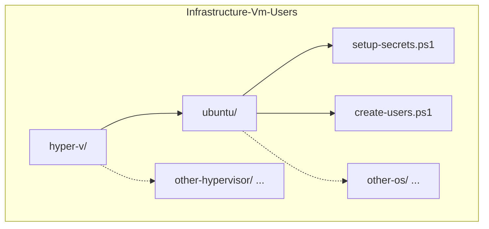
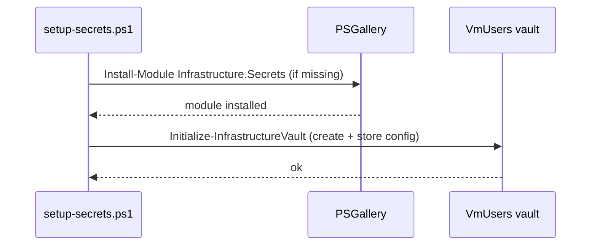
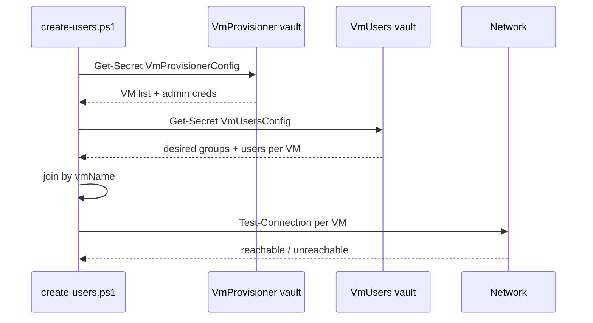
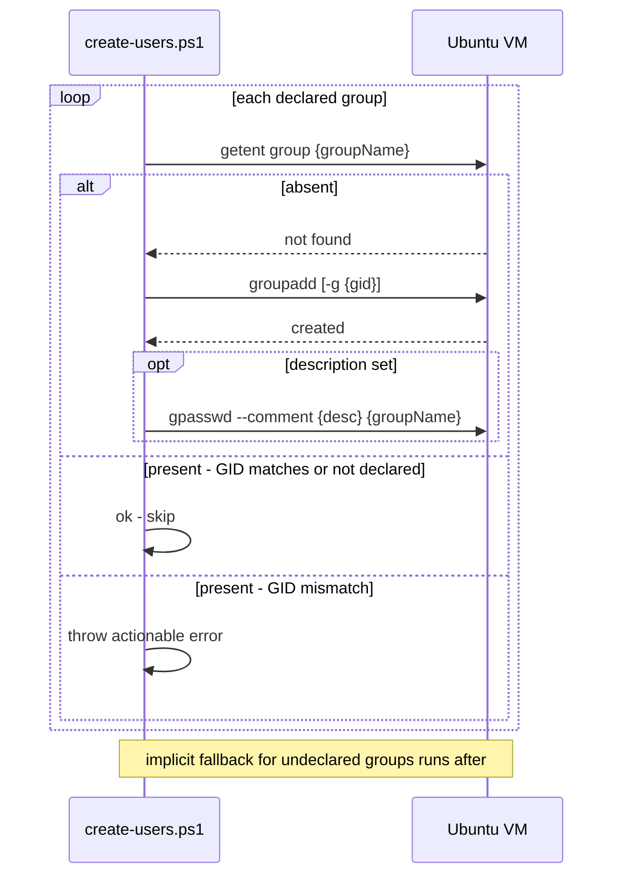
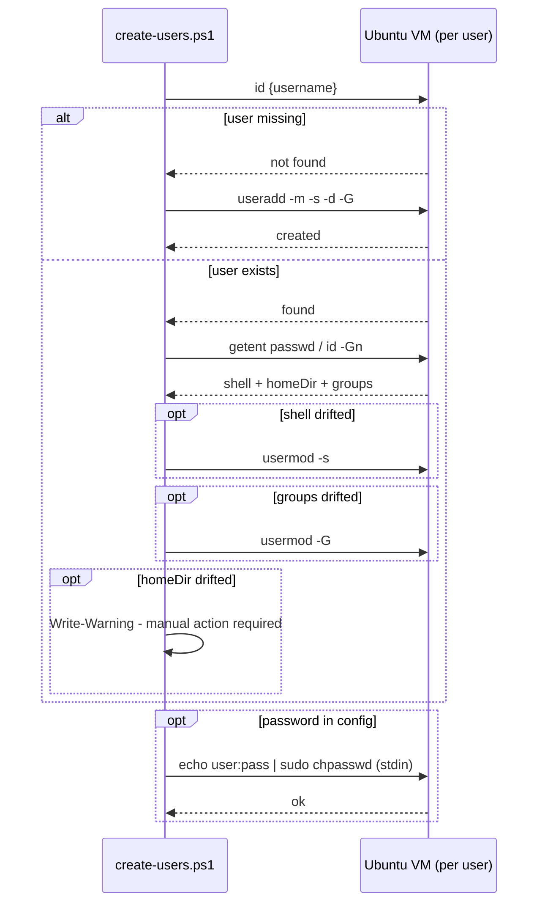
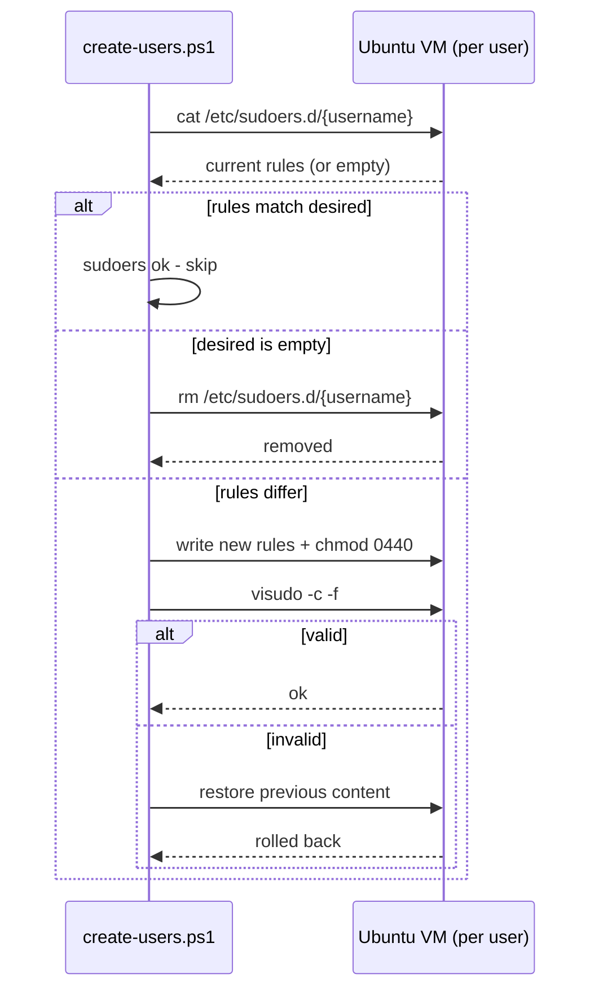
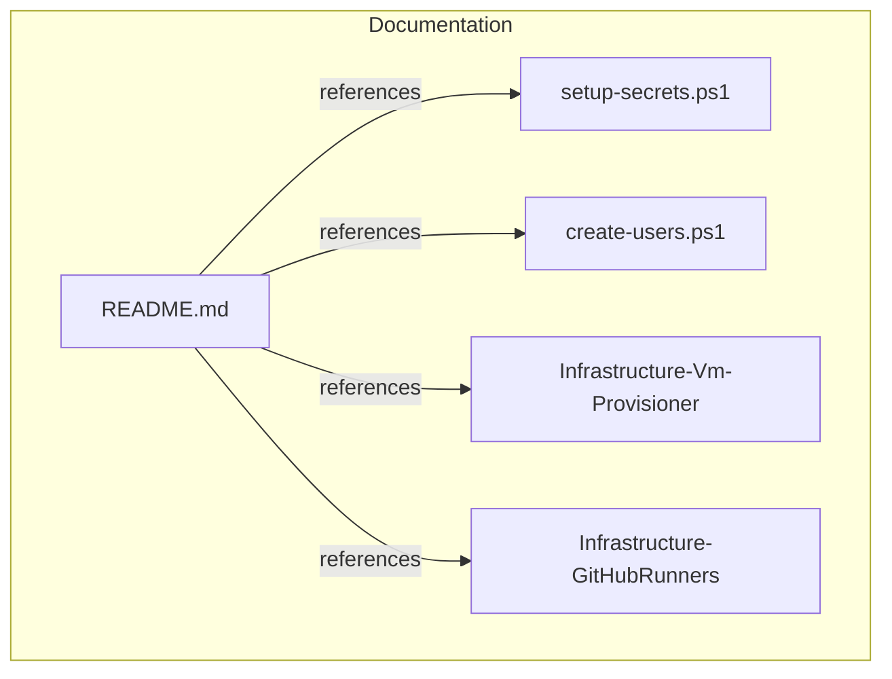

# Implementation Plan

## Index
- [Step 1 - Repo skeleton](#step-1---repo-skeleton)
- [Step 2 - setup-secrets.ps1](#step-2---setup-secretsps1)
- [Step 3 - create-users.ps1: vault read + validation](#step-3---create-usersps1-vault-read--validation)
- [Step 4 - create-users.ps1: group reconciliation via SSH](#step-4---create-usersps1-group-reconciliation-via-ssh)
- [Step 5 - create-users.ps1: user reconciliation via SSH](#step-5---create-usersps1-user-reconciliation-via-ssh)
- [Step 6 - create-users.ps1: sudoers reconciliation](#step-6---create-usersps1-sudoers-reconciliation)
- [Step 7 - README.md](#step-7---readmemd)

---

## Step 1 - Repo skeleton

**What:** Create directory structure and placeholder files.

```
hyper-v/
└── ubuntu/
    ├── setup-secrets.ps1
    └── create-users.ps1
```

**Why:** Follows the `hypervisor/guest-os/` convention from
Infrastructure-Vm-Provisioner. Additional hypervisors or guest OSes slot
in as new subdirectories without changing the root structure.



---

## Step 2 - setup-secrets.ps1

**What:** Script that installs `Infrastructure.Secrets` from PSGallery and
calls `Initialize-InfrastructureVault` with:
- Vault: `VmUsers`
- Secret: `VmUsersConfig`
- Validation: checks required fields per VM entry and group entry

**Config schema** - desired groups and users per VM, matched to provisioner
VMs by `vmName`:

```jsonc
[
  {
    "vmName": "ubuntu-01-ci",
    // Optional. Declares groups that must exist before users are reconciled.
    // Allows pinning GIDs (required for NFS / Docker volume mounts that
    // match ownership by number) and declaring groups with no members here
    // (e.g. a shared directory group managed by Infrastructure-GitHubRunners).
    "groups": [
      {
        "groupName": "u-actions-runner"
      }
    ],
    "users": [
      {
        "username":     "u-actions-runner",
        "shell":        "/usr/sbin/nologin",
        "homeDir":      "/home/u-actions-runner",
        // No supplementary groups. useradd creates the u-actions-runner
        // primary group automatically; u-runner-deploy joins it as a
        // supplementary member - u-actions-runner itself does not need to.
        "groups":       [],
        "sudoersRules": []
      },
      {
        "username":     "u-runner-deploy",
        "shell":        "/bin/bash",
        "homeDir":      "/home/u-runner-deploy",
        // Joins u-actions-runner as a supplementary group to write into
        // /home/u-actions-runner/runners/ (set g+rwx by GitHubRunners repo).
        "groups":       ["u-actions-runner"],
        // Optional. When present, always written via chpasswd - no comparison
        // is possible with a hashed password on the VM. This vault entry is
        // the canonical source of the password for consuming repos such as
        // Infrastructure-GitHubRunners. Must never appear in console output.
        "password":     "...",
        "sudoersRules": [
          "u-runner-deploy ALL=(u-actions-runner) NOPASSWD: /home/u-actions-runner/runners/*/config.sh",
          "u-runner-deploy ALL=(u-actions-runner) NOPASSWD: /home/u-actions-runner/runners/*/svc.sh",
          "u-runner-deploy ALL=(root) NOPASSWD: /bin/systemctl start actions.runner.*",
          "u-runner-deploy ALL=(root) NOPASSWD: /bin/systemctl is-active actions.runner.*"
        ]
      }
    ]
  }
]
```



---

## Step 3 - create-users.ps1: vault read + validation

**What:** Opening section of `create-users.ps1` that:
1. Reads `VmProvisionerConfig` from the `VmProvisioner` vault - VM names,
   IPs, and admin credentials.
2. Reads `VmUsersConfig` from the `VmUsers` vault - desired groups and users
   per VM.
3. Joins the two by `vmName` - warns and skips any VM in `VmUsersConfig`
   that has no matching entry in `VmProvisionerConfig`.
4. Checks each matched VM with a ping - warns if unreachable, skips.
5. Emits structured output for each decision.

**Why:** Reading admin credentials from the existing `VmProvisioner` vault
avoids duplication and prompting. Joining by `vmName` keeps the two vaults
independent - either can change without the other needing to be updated.



---

## Step 4 - create-users.ps1: group reconciliation via SSH

**What:** For each matched, reachable VM, before processing users, reconcile
the declared `groups` array:

1. `getent group {groupName}` - check existence and current GID.
2. **Absent** - `groupadd [-g {gid}] {groupName}`.
3. **Present, GID matches** (or no GID declared) - `ok`, skip.
4. **Present, GID mismatch** - throw an actionable error. Silent correction
   would renumber files on disk owned by the old GID.
5. If `description` is set, write it via `gpasswd --comment` (informational,
   never read back for reconciliation).

Groups referenced in `users[].groups` but not declared in `groups` are
created implicitly with `groupadd` (no GID pinning). This fallback keeps
simple configs concise.

**Why:** Group reconciliation must precede user reconciliation because
`useradd -G` and `usermod -G` fail if a referenced group does not yet exist.
Explicit declaration allows GID pinning, which is required for NFS and Docker
bind mounts. A GID conflict is an error not a silent fix to protect ownership
of files already on disk.



---

## Step 5 - create-users.ps1: user reconciliation via SSH

**What:** For each matched, reachable VM, for each desired user:
1. Check if the user exists (`id {username}`).
2. If not: `useradd` with the specified shell, home directory, and groups.
3. If yes: read current shell (`getent passwd`), supplementary groups
   (`id -Gn`), and home directory (`getent passwd`), then:
   - **shell** drifted: `usermod -s`
   - **groups** drifted: `usermod -G` (replaces full supplementary list)
   - **homeDir** drifted: emit a `Write-Warning` — moving a home directory
     risks data loss and must be done manually. Do not silently skip;
     silent drift means the operator never knows the config and the VM
     disagree.
   - **other fields** (UID, primary group name, GECOS): not managed by
     this script; if they differ the script takes no action and emits no
     warning. These fields are outside the config schema and their drift
     is the operator's responsibility.
4. If `password` is present in the user config: always set it via
   `chpasswd` regardless of whether the user was just created or already
   existed. Comparison is impossible — a Unix password hash cannot be
   compared to a plaintext value — so always overwriting is the only safe
   approach. The password must not appear in the SSH command string; pipe
   it via stdin: `echo '{username}:{password}' | sudo chpasswd`.
5. Emit a per-user result line: `created`, `updated`, or `ok`. Password
   setting is never reflected in the result line — its value must not
   appear in output.

**Why:** Reconciling rather than just creating means re-running is always
safe and drifted config (e.g. shell changed manually) is corrected.
Explicit warnings on homeDir drift prevent silent disagreement between
config and VM state. Always overwriting the password on each run ensures
the vault is the authoritative source — a password changed manually on
the VM is corrected back. Piping via stdin avoids the password appearing
in the process argument list, which is visible in `ps aux` output.



---

## Step 6 - create-users.ps1: sudoers reconciliation

**What:** For each user, after user creation/update:
1. Read current rules from `/etc/sudoers.d/{username}` (empty if file
   absent).
2. Compare with desired rules.
3. If different: rewrite the file with desired rules, `chmod 0440`,
   validate with `visudo -c -f` - abort if invalid, leaving the live file
   untouched.
4. If identical: skip.
5. Emit a per-user result: `sudoers updated`, `sudoers removed` (if desired
   is empty and file existed), or `sudoers ok`.

**Why:** Full reconciliation (not just append) ensures rules removed from
the config are also removed from the VM. `visudo -c` validation prevents a
broken sudoers from locking out all sudo access.



---

## Step 7 - README.md

**What:** Root `README.md` covering:
- What this repo does and what it does not do.
- Prerequisites (Windows 11, VMs provisioned, `VmProvisioner` vault set up).
- Quick start (setup-secrets -> create-users).
- JSON config reference with a runner users example including groups.
- Idempotency and reconciliation behaviour (including GID conflict note).
- Repo structure.

**Why:** Required after each step per global instructions; primary
onboarding document for the repo.


