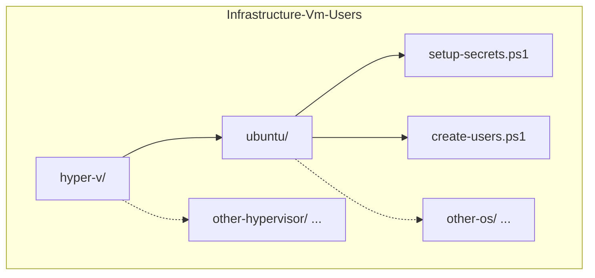
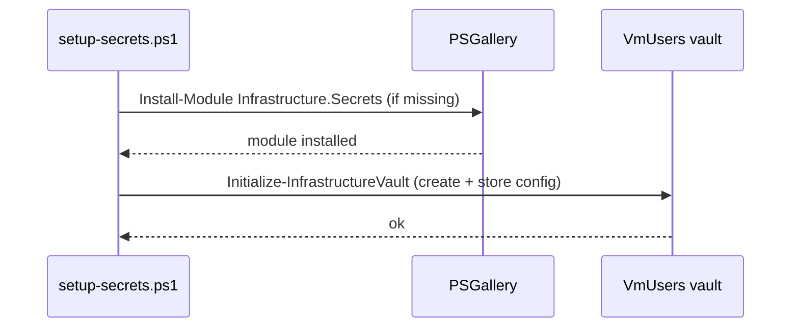
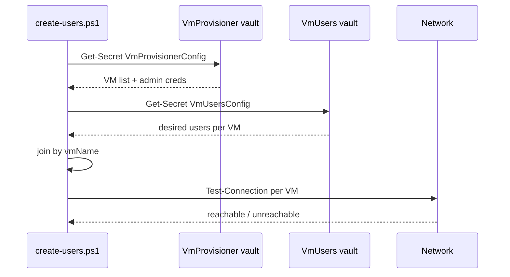
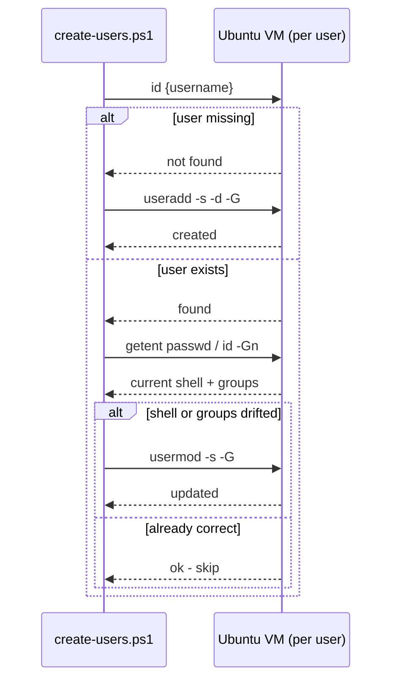
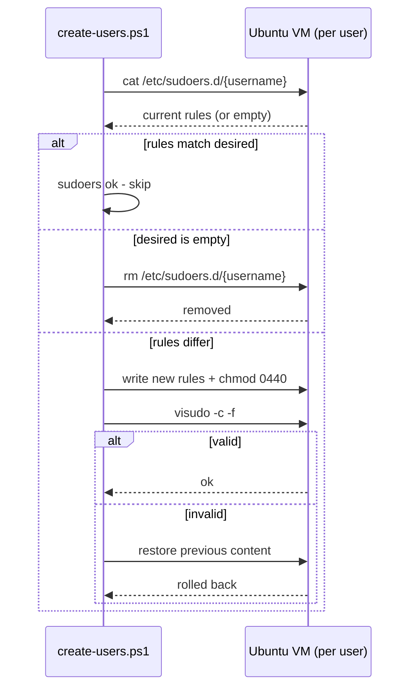
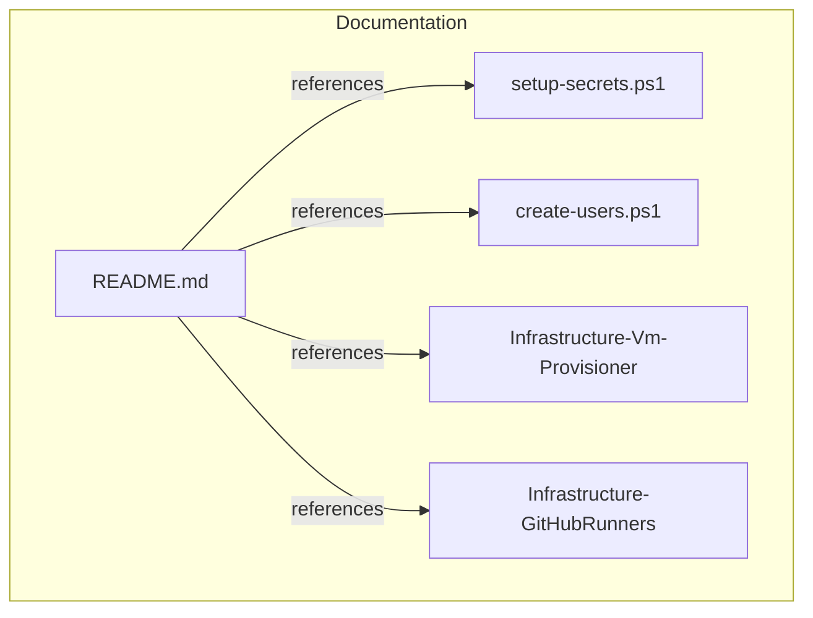

# Implementation Plan

## Index
- [Step 1 - Repo skeleton](#step-1---repo-skeleton)
- [Step 2 - setup-secrets.ps1](#step-2---setup-secretsps1)
- [Step 3 - create-users.ps1: vault read + validation](#step-3---create-usersps1-vault-read--validation)
- [Step 4 - create-users.ps1: user reconciliation via SSH](#step-4---create-usersps1-user-reconciliation-via-ssh)
- [Step 5 - create-users.ps1: sudoers reconciliation](#step-5---create-usersps1-sudoers-reconciliation)
- [Step 6 - README.md](#step-6---readmemd)

---

## Step 1 - Repo skeleton

**What:** Create directory structure and placeholder files.

```
hyper-v/
└── ubuntu/
    ├── setup-secrets.ps1
    └── create-users.ps1
```

**Why:** Follows the `hypervisor/guest-os/` convention from
Infrastructure-Vm-Provisioner. Additional hypervisors or guest OSes slot
in as new subdirectories without changing the root structure.



---

## Step 2 - setup-secrets.ps1

**What:** Script that installs `Infrastructure.Secrets` from PSGallery and
calls `Initialize-InfrastructureVault` with:
- Vault: `VmUsers`
- Secret: `VmUsersConfig`
- Validation: checks required fields per VM entry

**Config schema** - desired users per VM, matched to provisioner VMs by
`vmName`:
```jsonc
[
  {
    "vmName": "ubuntu-01-ci",
    "users": [
      {
        "username":     "u-actions-runner",
        "shell":        "/usr/sbin/nologin",
        "homeDir":      "/home/u-actions-runner",
        "groups":       [],
        "sudoersRules": []
      },
      {
        "username":     "u-runner-deploy",
        "shell":        "/bin/bash",
        "homeDir":      "/home/u-runner-deploy",
        "groups":       [],
        "sudoersRules": [
          "u-runner-deploy ALL=(u-actions-runner) NOPASSWD: /home/u-actions-runner/runners/*/config.sh",
          "u-runner-deploy ALL=(u-actions-runner) NOPASSWD: /home/u-actions-runner/runners/*/svc.sh",
          "u-runner-deploy ALL=(root) NOPASSWD: /bin/systemctl start actions.runner.*",
          "u-runner-deploy ALL=(root) NOPASSWD: /bin/systemctl is-active actions.runner.*"
        ]
      }
    ]
  }
]
```



---

## Step 3 - create-users.ps1: vault read + validation

**What:** Opening section of `create-users.ps1` that:
1. Reads `VmProvisionerConfig` from the `VmProvisioner` vault - VM names,
   IPs, and admin credentials.
2. Reads `VmUsersConfig` from the `VmUsers` vault - desired users per VM.
3. Joins the two by `vmName` - warns and skips any VM in `VmUsersConfig`
   that has no matching entry in `VmProvisionerConfig`.
4. Checks each matched VM with a ping - warns if unreachable, skips.
5. Emits structured output for each decision.

**Why:** Reading admin credentials from the existing `VmProvisioner` vault
avoids duplication and prompting. Joining by `vmName` keeps the two vaults
independent - either can change without the other needing to be updated.



---

## Step 4 - create-users.ps1: user reconciliation via SSH

**What:** For each matched, reachable VM, for each desired user:
1. Check if the user exists (`id {username}`).
2. If not: `useradd` with the specified shell, home directory, and groups.
3. If yes: check shell and groups match desired state; update if not
   (`usermod`).
4. Emit a per-user result line: `created`, `updated`, or `ok`.

**Why:** Reconciling rather than just creating means re-running is always
safe and drifted config (e.g. shell changed manually) is corrected.



---

## Step 5 - create-users.ps1: sudoers reconciliation

**What:** For each user, after user creation/update:
1. Read current rules from `/etc/sudoers.d/{username}` (empty if file
   absent).
2. Compare with desired rules.
3. If different: rewrite the file with desired rules, `chmod 0440`,
   validate with `visudo -c -f` - abort and restore previous content
   if invalid.
4. If identical: skip.
5. Emit a per-user result: `sudoers updated`, `sudoers removed` (if desired
   is empty and file existed), or `sudoers ok`.

**Why:** Full reconciliation (not just append) ensures rules removed from
the config are also removed from the VM. `visudo -c` validation prevents a
broken sudoers from locking out all sudo access.



---

## Step 6 - README.md

**What:** Root `README.md` covering:
- What this repo does and what it does not do.
- Prerequisites (Windows 11, OpenSSH, VMs provisioned,
  `VmProvisioner` vault already set up).
- Quick start (setup-secrets -> create-users).
- JSON config reference with a runner users example.
- Idempotency and reconciliation behaviour.
- Repo structure.

**Why:** Required after each step per global instructions; primary
onboarding document for the repo.


