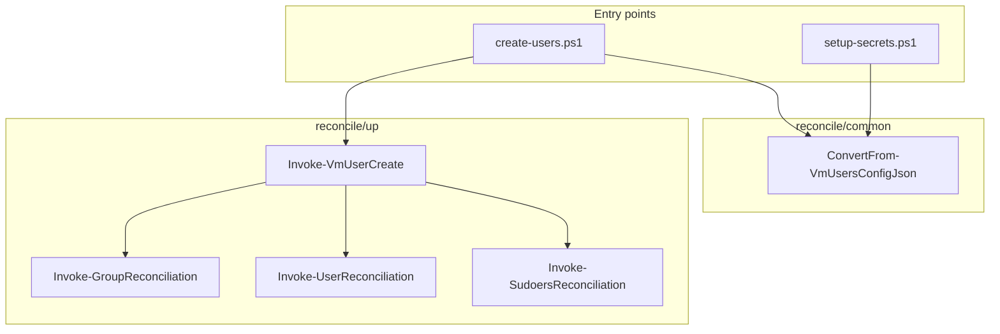
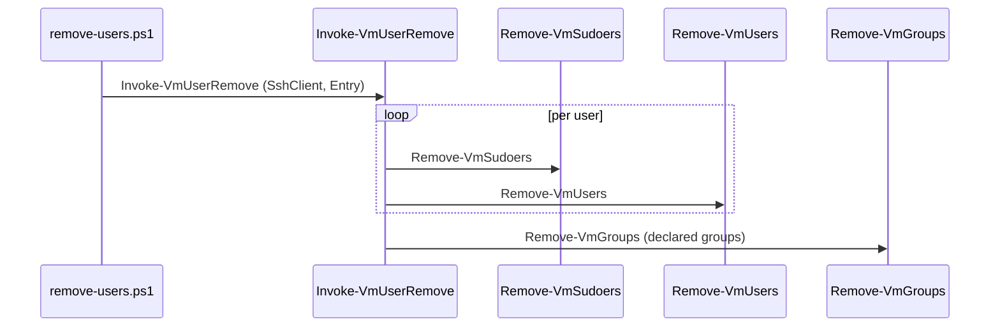
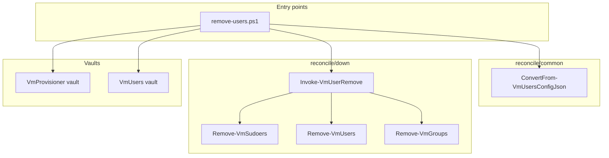

# Plan: User Removal

## Index

- [Overview](#overview)
- [Target folder structure](#target-folder-structure)
- [Steps](#steps)
  - [Step 1 - Folder restructure](#step-1---folder-restructure)
  - [Step 2 - Remove-VmSudoers](#step-2---remove-vmsudoers)
  - [Step 3 - Remove-VmUsers](#step-3---remove-vmusers)
  - [Step 4 - Remove-VmGroups](#step-4---remove-vmgroups)
  - [Step 5 - Invoke-VmUserRemove](#step-5---invoke-vmuserremove)
  - [Step 6 - remove-users.ps1](#step-6---remove-usersps1)

---

## Overview

Two sequential concerns:

1. **Restructure** the `reconcile/` folder to match the layered
   `common/up/down/` convention used in Infrastructure-GitHubRunners.
   No behaviour changes; only file moves, renames, and path updates.

2. **Implement removal** - the reverse of creation, using the same vault
   config and the same SSH plumbing, with new per-resource helpers and a
   new entry-point script.

See [problem.md](problem.md) for context and constraints.

---

## Target folder structure

```
hyper-v/ubuntu/
  create-users.ps1           (updated dot-source paths + extracted loop)
  remove-users.ps1           (new)
  setup-secrets.ps1          (updated dot-source path)
  reconcile/
    common/
      ConvertFrom-VmUsersConfigJson.ps1  (moved from reconcile/)
    up/
      Invoke-GroupReconciliation.ps1     (renamed from reconcile-groups.ps1)
      Invoke-SudoersReconciliation.ps1   (renamed from reconcile-sudoers.ps1)
      Invoke-UserReconciliation.ps1      (renamed from reconcile-users.ps1)
      Invoke-VmUserCreate.ps1            (extracted from create-users.ps1)
    down/
      Invoke-VmUserRemove.ps1            (new)
      Remove-VmGroups.ps1                (new)
      Remove-VmSudoers.ps1               (new)
      Remove-VmUsers.ps1                 (new)
Tests/
  reconcile/
    common/
      ConvertFrom-VmUsersConfigJson.Tests.ps1  (moved)
    up/
      Invoke-GroupReconciliation.Tests.ps1     (moved)
      Invoke-SudoersReconciliation.Tests.ps1   (moved)
      Invoke-UserReconciliation.Tests.ps1       (moved)
      Invoke-VmUserCreate.Tests.ps1             (new)
    down/
      Invoke-VmUserRemove.Tests.ps1    (new)
      Remove-VmGroups.Tests.ps1        (new)
      Remove-VmSudoers.Tests.ps1       (new)
      Remove-VmUsers.Tests.ps1         (new)
  Integration/
    (existing files unchanged; new removal integration tests added in Step 6)
```

---

## Steps

### Step 1 - Folder restructure

**Why**: The flat `reconcile/` folder will become crowded as removal helpers
are added alongside creation helpers. Separating into `common/`, `up/`, and
`down/` mirrors the convention in Infrastructure-GitHubRunners and makes
navigation unambiguous.

**Changes**:

- Create `reconcile/common/`, `reconcile/up/`, `reconcile/down/`.
- Move `ConvertFrom-VmUsersConfigJson.ps1` into `reconcile/common/`.
- Move and rename the three reconcile files into `reconcile/up/`:
  - `reconcile-groups.ps1`   -> `Invoke-GroupReconciliation.ps1`
  - `reconcile-users.ps1`    -> `Invoke-UserReconciliation.ps1`
  - `reconcile-sudoers.ps1`  -> `Invoke-SudoersReconciliation.ps1`
- Extract the per-VM SSH loop from `create-users.ps1` (lines 178-254)
  into `reconcile/up/Invoke-VmUserCreate.ps1`. `create-users.ps1` calls
  `Invoke-VmUserCreate` instead.
- Update dot-source paths in `create-users.ps1` and `setup-secrets.ps1`.
- Mirror the test file moves under `Tests/reconcile/common/` and
  `Tests/reconcile/up/`. Add `Invoke-VmUserCreate.Tests.ps1` for the
  extracted function.
- Update README repo structure section to reflect new folder layout.

**Tests**: `Invoke-VmUserCreate.Tests.ps1` - verify that the function
calls `Invoke-GroupReconciliation`, `Invoke-UserReconciliation`, and
`Invoke-SudoersReconciliation` for each user; verify optional `groups`
property handled when absent.



---

### Step 2 - Remove-VmSudoers

**Why**: Sudoers files must be removed first in the removal sequence -
they grant the user elevated access and should be revoked before the
account itself is deleted.

**File**: `reconcile/down/Remove-VmSudoers.ps1`

**Behaviour**:
- For each user in the target list:
  - Check whether `/etc/sudoers.d/<username>` exists via SSH.
  - If present: remove it.
  - If absent: log and skip (idempotent).

**Tests**: `Tests/reconcile/down/Remove-VmSudoers.Tests.ps1`
- Calls the remove command when the sudoers file exists.
- Skips without error when the file is absent.
- Processes each user independently when multiple users are passed.

**README**: Add `Remove-VmSudoers` to the repo structure under
`reconcile/down/`.

---

### Step 3 - Remove-VmUsers

**Why**: `userdel -r` removes the user account and home directory atomically.
Must run after sudoers removal and before group removal (groups cannot be
deleted while members exist).

**File**: `reconcile/down/Remove-VmUsers.ps1`

**Behaviour**:
- For each user:
  - Check whether the user exists (`id <username>`).
  - If present: `sudo userdel -r <username>`.
  - If absent: log and skip (idempotent).
- Non-zero exit that is not "user does not exist" throws.

**Tests**: `Tests/reconcile/down/Remove-VmUsers.Tests.ps1`
- Calls `userdel -r` when the user exists.
- Skips without error when the user is absent.
- Throws when `userdel` exits non-zero for an unexpected reason.

**README**: Add `Remove-VmUsers` to the repo structure under
`reconcile/down/`.

---

### Step 4 - Remove-VmGroups

**Why**: Groups declared in the config were created by
`Invoke-GroupReconciliation` and should be cleaned up on removal.
Implicit groups (named after the username) are already removed by
`userdel`, so only declared groups need explicit handling here.

**File**: `reconcile/down/Remove-VmGroups.ps1`

**Behaviour**:
- Only processes groups listed in the `groups` array of the config entry
  (declared groups). Implicit groups are not touched.
- For each declared group:
  - Check whether the group exists (`getent group <groupName>`).
  - If present and has no members: `sudo groupdel <groupName>`.
  - If present but still has members: warn and skip (another user outside
    this config may still belong to it).
  - If absent: log and skip (idempotent).

**Tests**: `Tests/reconcile/down/Remove-VmGroups.Tests.ps1`
- Calls `groupdel` when the group exists and has no members.
- Warns and skips when the group has remaining members.
- Skips without error when the group is absent.
- Skips without action when no declared groups are in the entry.

**README**: Add `Remove-VmGroups` to the repo structure under
`reconcile/down/`.

---

### Step 5 - Invoke-VmUserRemove

**Why**: Mirrors `Invoke-VmUserCreate` on the removal side - owns the
per-VM orchestration and enforces the correct removal sequence.

**File**: `reconcile/down/Invoke-VmUserRemove.ps1`

**Sequence per VM**:

1. `Remove-VmSudoers` - revoke elevated access first.
2. `Remove-VmUsers` - delete accounts and home directories.
3. `Remove-VmGroups` - delete declared groups now that members are gone.

**Tests**: `Tests/reconcile/down/Invoke-VmUserRemove.Tests.ps1`
- Calls all three helpers for each user entry.
- Calls `Remove-VmGroups` once per VM (not per user) with the full
  declared groups list.
- Enforces order: sudoers before users before groups.

**README**: Add `Invoke-VmUserRemove` to the repo structure under
`reconcile/down/`.



---

### Step 6 - remove-users.ps1

**Why**: Entry point that mirrors `create-users.ps1` exactly in structure:
same vault reads, same join, same ping, same SSH loop - calling
`Invoke-VmUserRemove` instead of `Invoke-VmUserCreate`.

**File**: `hyper-v/ubuntu/remove-users.ps1`

**Behaviour**:
- Bootstrap PowerShell.Common, Infrastructure.Secrets, Posh-SSH
  (same block as `create-users.ps1`).
- Dot-source all `reconcile/common/` and `reconcile/down/` helpers.
- Read `VmProvisionerConfig` and `VmUsersConfig` from vaults.
- Join by `vmName`, ping, SSH loop.
- Call `Invoke-VmUserRemove` per reachable VM.
- Unreachable VMs: warn and skip (no force mode - see
  [problem.md](problem.md#constraints)).

**Tests**: None at the script level (vault and SSH bootstrap are not
unit-testable; integration is covered by `Invoke-VmUserRemove` tests).

**README**:
- **What this repo does** - extend to mention removal alongside
  reconciliation.
- **What it does not do** - remove the stale "Delete users - removal must
  be done manually" bullet (no longer true once this script exists).
- **Quick start** - add `remove-users.ps1` as step 3.
- **Removal section** (new) - removal sequence (sudoers -> users ->
  groups), idempotency guarantee, unreachable VM behaviour (warn and
  skip).
- **Repo structure** - add `remove-users.ps1` entry point.


