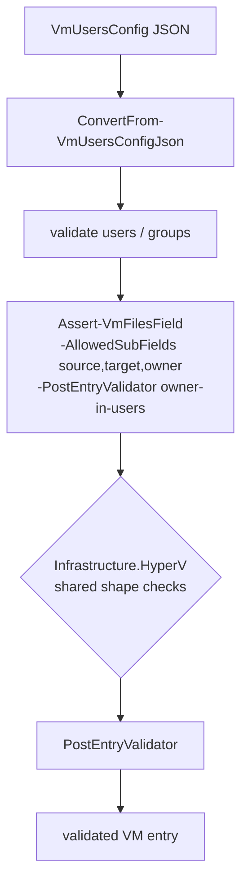
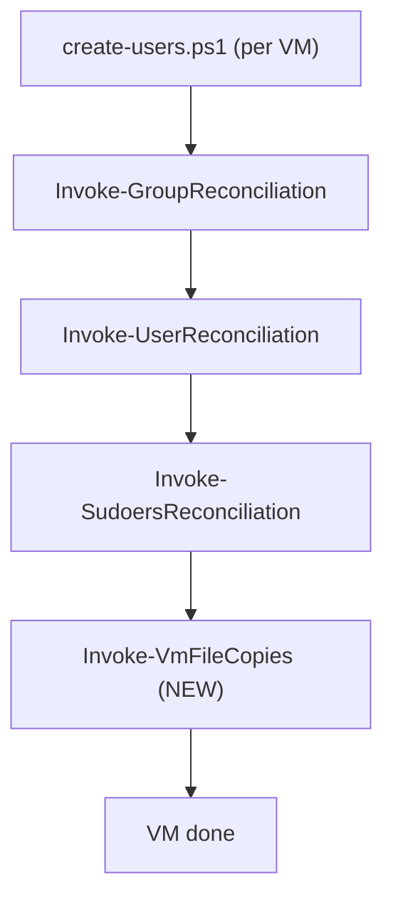

# Plan: User-owned file copies in Vm-Users

See [problem.md](problem.md) for context, scope, and rationale.

## Index

- [Step 1 - Schema extension for `files` with `owner`](#step-1---schema-extension-for-files-with-owner)
- [Step 2 - Post-reconciliation file-copy step](#step-2---post-reconciliation-file-copy-step)
- [Step 3 - Wire the step into `create-users.ps1`](#step-3---wire-the-step-into-create-usersps1)
- [Step 4 - E2E coverage](#step-4---e2e-coverage)

---

## Step 1 - Schema extension for `files` with `owner`

**Reason:** Fail fast on bad config before any VM work. The shared
validator handles the array/object/path/strict-fields checks; this
step adds Vm-Users' two extra rules: `owner` is required, and `owner`
must be a user this run is creating on the same VM.

**Decisions locked**

- The shared validator (`Assert-VmFilesField`) is consumed from
  Infrastructure.HyperV (v0.3.0+). This repo does **not** redefine
  it; only the policy on top (extra allowed sub-fields + per-entry
  rules) lives here.
- The `files` array sits on the **VM entry**, alongside `users` /
  `groups` - not on each user. Most copies in practice are "drop these
  N files on this VM, each owned by one of its users", and this shape
  lets a single SSH session push all of them per VM. Per-user nesting
  would split copies across SSH sessions unnecessarily.
- `owner` is **required** on every entry. There is no implicit default
  (no fallback to `root` or to the SSH user); the entire point of this
  feature is per-user ownership, so a missing `owner` is almost always
  an operator mistake.
- `owner` must reference a user defined in the **same VM entry's**
  `users` array. The copy step runs immediately after user
  reconciliation, so the only users guaranteed to exist are the ones
  this run created on this specific VM. Validating against the
  same-entry list catches typos before any SSH work begins.

**Files**

- `hyper-v/ubuntu/reconcile/common/ConvertFrom-VmUsersConfigJson.ps1` -
  after the existing `users` / `groups` validation, call
  `Assert-VmFilesField` with the extended allow-list and a
  `PostEntryValidator` that enforces the two rules above. No new file
  for the validator itself - the shared shape lives in
  Infrastructure.HyperV.
- `hyper-v/ubuntu/Install-ModuleDependencies.ps1` - bump the
  Infrastructure.HyperV pin to `'0.3.0'` (or whatever ships
  `Assert-VmFilesField`).
- `Tests/reconcile/common/ConvertFrom-VmUsersConfigJson.Tests.ps1` -
  add cases for the new field (no behavioural duplication of the
  shared validator - those tests live in Infrastructure.HyperV).

**Behaviour**

Call shape inside `ConvertFrom-VmUsersConfigJson`:

```powershell
$context = @{
    KnownUsers = @($entry.users | ForEach-Object { $_.username })
    VmName     = $entry.vmName
}
Assert-VmFilesField `
    -Vm                        $entry `
    -AllowedSubFields          @('source', 'target', 'owner') `
    -PostEntryValidator        {
        param($fileEntry, $context)
        if (-not $fileEntry.PSObject.Properties['owner']) {
            throw "VM '$($context.VmName)': files[*].owner is required."
        }
        if ($fileEntry.owner -isnot [string] -or
            [string]::IsNullOrWhiteSpace($fileEntry.owner)) {
            throw "VM '$($context.VmName)': files[*].owner must be a non-empty string."
        }
        if ($fileEntry.owner -notin $context.KnownUsers) {
            throw ("VM '$($context.VmName)': files[*].owner " +
                "'$($fileEntry.owner)' is not a user this VM entry creates. " +
                "Known users: $($context.KnownUsers -join ', ').")
        }
    } `
    -PostEntryValidatorContext $context
```

**Tests (unit, mocked)**

- Mock `Assert-VmFilesField`; assert the wiring:
  - Called once per VM entry.
  - Called with `-AllowedSubFields` exactly equal to
    `@('source','target','owner')`.
  - Called with `-PostEntryValidator` non-null.
  - `-PostEntryValidatorContext.KnownUsers` equals the entry's
    `users[].username` list.
- One end-to-end case calling the real `Assert-VmFilesField` (loaded
  from the module, or stubbed to return without checks) that confirms
  the `PostEntryValidator` throws when `owner` references an unknown
  user.
- One case asserting `owner` is required: an entry with
  `{ source, target }` but no `owner` must throw.

**Diagram**



---

## Step 2 - Post-reconciliation file-copy step

**Reason:** Place the actual bytes on the VM, owned by the requested
user, with mode `0640`. Uses the shared transport so no new SSH /
file-server scaffolding is invented.

**Decisions locked**

- The transport primitive (`Copy-VmFiles`) is consumed from
  Infrastructure.HyperV (v0.3.0+); this repo never reimplements
  per-entry mkdir/curl/chown/chmod logic.
- Default file mode is **`0640`** (owner read/write, group read,
  others none). User-owned files often carry secrets; `0644` (the
  provisioner's default) is too permissive for that use case. A
  `mode` sub-field is **not** added in v1 - if a concrete use case
  needs an override, extend the allow-list then.
- The owner string passed to `Copy-VmFiles` is `"<owner>:<owner>"`
  so the file is owned by the user's primary group too. A separate
  `group` sub-field is deferred until a concrete use case appears.
- File-server + SSH session are opened **once per VM** for file copies,
  separate from the per-VM SSH session that user reconciliation
  already opens. Keeping the file-server lifecycle local to this step
  preserves the existing structure of `create-users.ps1` and avoids
  retrofitting an "orchestrator" abstraction into a repo that has
  worked fine without one. The duplicated SSH login is cheap.

**Files**

- `hyper-v/ubuntu/reconcile/up/Invoke-VmFileCopies.ps1` (new) - opens
  one file server + SSH session per VM, builds `-Entries` from
  `$entry.files`, calls `Copy-VmFiles`. Self-skips when `files` is
  absent or empty.
- `Tests/reconcile/up/Invoke-VmFileCopies.Tests.ps1` (new) - wiring
  tests (transport opened, entries shaped correctly, mode/owner
  defaults applied). Per-entry shell-shape coverage lives in
  Infrastructure.HyperV's `Copy-VmFiles.Tests.ps1`.

**Behaviour**

```
function Invoke-VmFileCopies($Entry, $Password) {
    if (-not $Entry.PSObject.Properties['files']) { return }
    $files = @($Entry.files)
    if ($files.Count -eq 0) { return }

    # Build entries with the Vm-Users defaults: Owner='user:user',
    # Mode='0640'. The cmdlet runs everything under sudo.
    $copyEntries = $files | ForEach-Object {
        [PSCustomObject]@{
            Source = $_.source
            Target = $_.target
            Owner  = "$($_.owner):$($_.owner)"
            Mode   = '0640'
        }
    }

    Invoke-WithVmFileServer -VmIpAddress $Entry.ipAddress -ScriptBlock {
        param($server)
        $sshClient = $null
        try {
            $sshClient = New-VmSshClient `
                             -IpAddress $Entry.ipAddress `
                             -Username  $Entry.adminUsername `
                             -Password  $Password
            Copy-VmFiles -SshClient $sshClient -Server $server -Entries $copyEntries
        } finally {
            if ($null -ne $sshClient) {
                if ($sshClient.IsConnected) { $sshClient.Disconnect() }
                $sshClient.Dispose()
            }
        }
    }.GetNewClosure()
}
```

Closure binding is required because `Invoke-WithVmFileServer` is in
another module - same reason as the provisioner's post-provisioning
orchestrator.

**Tests (unit, mocked)**

- No-op when `files` is absent.
- No-op when `files` is empty.
- For a non-empty array: file server opened once for the VM,
  SSH connected as the admin user, `Copy-VmFiles` called once with
  `-Entries` matching the JSON shape and Owner / Mode defaults filled
  in.
- SSH client is disposed even when `Copy-VmFiles` throws (finally
  semantics).

---

## Step 3 - Wire the step into `create-users.ps1`

**Reason:** Files must be placed after the users they belong to exist.
The natural insertion point is right after user-reconciliation finishes
successfully for a VM.

**Decisions locked**

- The copy step runs **after** user reconciliation succeeds. If user
  reconciliation fails for a VM, file copies are skipped for that VM -
  no point trying to chown to a user that did not get created. The
  existing per-VM error handling already aborts the per-VM block, so
  no new guard is needed in this step.

**Files**

- `hyper-v/ubuntu/create-users.ps1` - dot-source
  `Invoke-VmFileCopies.ps1`; after the existing per-VM
  reconciliation block succeeds, call
  `Invoke-VmFileCopies -Entry $entry -Password $adminPassword`. If
  reconciliation threw, skip this VM's file copies (the existing error
  handling already aborts the per-VM block).
- `Tests/create-users.Tests.ps1` (if a structural wiring test exists
  there, mirroring Vm-Provisioner's `provision.Tests.ps1`) - assert
  the dot-source and call ordering.

**Behaviour**

The call is **unconditional**; `Invoke-VmFileCopies` self-skips when
`files` is absent. This mirrors how `Invoke-VmPostProvisioning` is
unconditional in the provisioner - the field guard lives inside the
called function.

**Diagram**



---

## Step 4 - E2E coverage

**Reason:** Unit tests cover the wiring; only a real VM exercises the
transport end-to-end (SSH login, file-server reachability, chown to a
user this run created).

**Files (live in `Infrastructure-E2E`, not this repo)**

- `agent/e2e/vm-users/Invoke-VmUsersTest.ps1` - extend the existing
  test to:
  - Add a small `files` entry to the test VmUsersConfig pointing at a
    temp fixture file on the host, targeting `/home/e2euser/fixture.bin`
    with `owner = 'e2euser'`.
  - After the user-reconciliation block, SSH into the VM and assert:
    - The target file exists.
    - It is owned by `e2euser:e2euser`.
    - Its mode is `0640`.
    - Its contents match the host fixture's contents (byte-for-byte).
- No new unit tests in the E2E repo - the agent-loop mock-level test
  already covers the agent's outer plumbing.

**Behaviour**

The fixture file is generated at test setup with 64 random bytes so the
content check has signal. The fixture path is cleaned up in the
teardown finally regardless of test outcome.

**Throw cases** (any fails the test, teardown still runs):

- Target file missing.
- Owner mismatch.
- Mode mismatch.
- Content mismatch.

---
