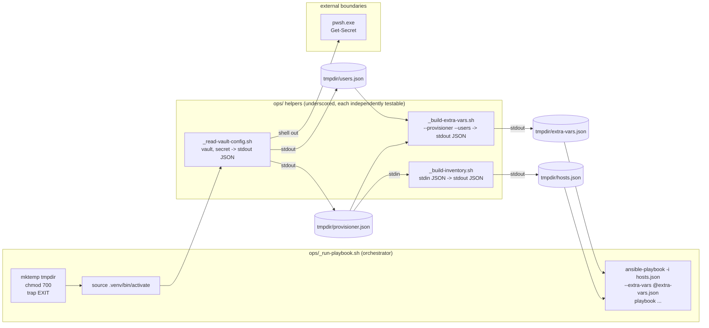
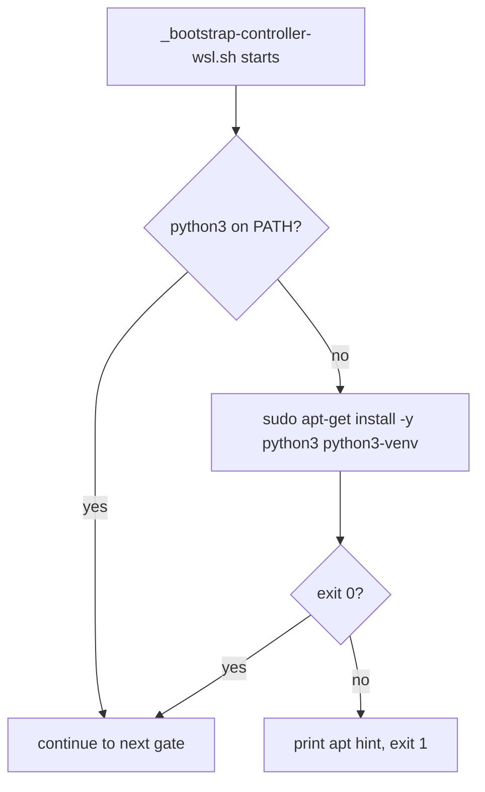
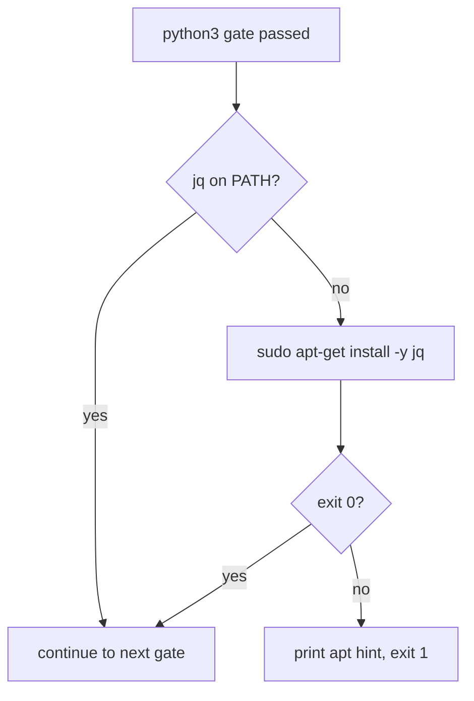
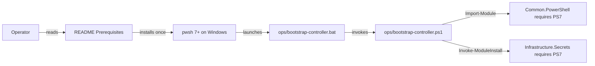
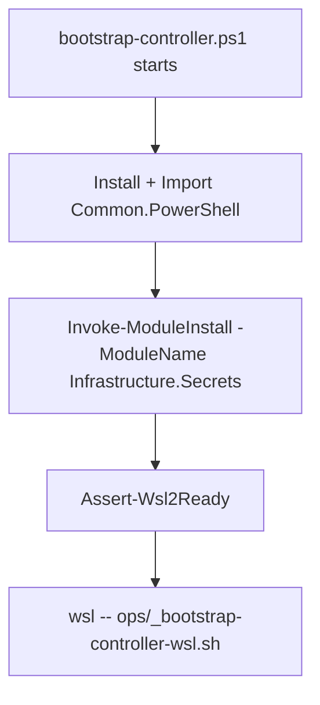

# Plan: Reconcile OS Groups, Users, and Sudoers via Ansible

See [problem.md](problem.md) for context, schema, and rationale.

## Directory layout (revised)

This plan uses three top-level buckets for executables:

- **`ops/<verb>-<noun>.{sh,ps1,bat}`** - operator-facing entry
  points. Hand-invoked by a human VM operator:
  `bootstrap-controller`, `setup-secrets`, `create-users`. Each
  command typically ships as three sibling files - `*.ps1` (or `*.sh`)
  + `*.bat` Explorer launcher.
- **`ops/_<verb>-<noun>.sh`** - bridge internals. Live alongside the
  operator entries (so a `cd ops/` shows the whole orchestration
  surface in one place) but the leading `_` marks them as "called by
  the operator entries, not typed by a human." Examples:
  `_run-playbook`, `_read-vault-config`, `_build-inventory`,
  `_build-extra-vars`.
- **`scripts/`** - dev/test runners only:
  `run-tests.{ps1,sh,bat}` (delegates to the canonical runners in
  `Common-PowerShell` and `Common-Automation`) and
  `fix-permissions.{sh,bat}`. Operator-facing for developers, not
  for VM operators - hence the separate directory from `ops/`.

Tests mirror this split: `Tests/ops/` covers both `ops/` public
entries (`*.ps1` via Pester) and `ops/_*` internals (`*.bats`);
`Tests/scripts/` would cover dev-runner tests if any existed (none
do today).

This split matches the GH-Common `ci-bash.yml` convention that labels
`scripts/` as "runner bash" - production and bridge code do not live
there. The underscore convention is the same one git uses for hooks
named `_*.sh` and that `_find-bash.bat` in GH-Common follows: visible
to siblings, not a target operators run directly.

## Index

- [Step 1 - Repo scaffolding](#step-1---repo-scaffolding)
- [Step 2 - Controller bootstrap](#step-2---controller-bootstrap)
- [Step 3 - Bash bridge: vault read, extra-vars, inventory, dispatch](#step-3---bash-bridge-vault-read-extra-vars-inventory-dispatch)
- [Step 4 - Bootstrap installs python3](#step-4---bootstrap-installs-python3)
- [Step 5 - Bootstrap installs jq](#step-5---bootstrap-installs-jq)
- [Step 6 - Document pwsh 7+ as an operator prerequisite](#step-6---document-pwsh-7-as-an-operator-prerequisite)
- [Step 7 - Bootstrap installs Infrastructure.Secrets module](#step-7---bootstrap-installs-infrastructuresecrets-module)
- [Step 8 - Vault setup script](#step-8---vault-setup-script)
- [Step 9 - Role: groups](#step-9---role-groups)
- [Step 10 - Role: users](#step-10---role-users)
- [Step 11 - Role: sudoers](#step-11---role-sudoers)
- [Step 12 - Playbook and operator entry point](#step-12---playbook-and-operator-entry-point)
- [Step 13 - E2E test layer for the Ansible users path](#step-13---e2e-test-layer-for-the-ansible-users-path)

---

## Step 1 - Repo scaffolding

**Reason:** Get the repo into a state where Ansible can be invoked from
WSL with the conventions every later step depends on, and where CI runs
green from the very first commit. The CI gate ships in the same step as
the substrate it guards — per the "CI alongside features" convention,
no feature lands without the lint coverage that will police it.

**Files**

- `ansible.cfg` (new) - inventory path placeholder, `interpreter_python = auto_silent`, `host_key_checking = False` (the VMs are short-lived and the inventory IPs are vault-controlled, not user-typed).
- `requirements.txt` (new) - one pinned line: `ansible-core==<version>`.
- `requirements.yml` (new) - Galaxy collections: `ansible.posix`, `community.general` pinned to a current version. No third-party collections in v1.
- `inventory/.gitkeep` (new) - placeholder so the dir exists.
- `roles/.gitkeep`, `playbooks/.gitkeep`, `scripts/.gitkeep` (new).
- `README.md` (new) - one-paragraph stub describing the repo's purpose and pointing at this feature folder. Each subsequent step extends the section it earns; there is no terminal docs pass.
- `.github/workflows/ci-yaml.yml` (new) - single-job reusable-workflow caller of [Common-Automation's `ci-yaml.yml`](../../../../Common-Automation/.github/workflows/ci-yaml.yml). Four lint jobs run against this repo from day one: `actionlint`, `action-validator`, `yamllint`, `ansible-lint`. `actionlint` and `action-validator` exercise the new `ci.yml` itself; `yamllint` covers `requirements.yml`, `ansible.cfg`, and every YAML file added in later steps; `ansible-lint` auto-skips this commit (no `playbooks/` content yet) and starts gating from step 8 onward when the first role lands.

**Behaviour**

File presence only. Two reproducibility checks tied to this step:

1. `ansible-playbook --version` invoked manually after a venv install (step 2) reports the pinned version from `requirements.txt`.
2. The first CI run on the branch passes all four jobs. `ansible-lint` reports its auto-skip `::notice::` because no Ansible content is committed yet; the other three lint their respective surfaces clean.

**Tests**

The CI run itself is the test - any finding from `yamllint`,
`actionlint`, or `action-validator` against the scaffolded files is
fixed in-line during this step, not relaxed at the workflow layer.
End-to-end coverage of the substrate stays in step 13 (the
Infrastructure-E2E fork).

---

## Step 2 - Controller bootstrap

**Reason:** Make it possible for a fresh Windows host to reach the state
where the bash bridge can run. Two scripts because `wsl --install` only
runs from Windows; everything else runs inside WSL.

**Decisions locked**

- WSL detection and install is delegated to `Assert-Wsl2Ready` from
  `Common.PowerShell` (PSGallery). No reimplementation here. The
  `Wsl2NotReady:` catch contract documented in that cmdlet's help is
  used verbatim.
- The Python venv lives at the repo root as `.venv/` (gitignored, see
  `.gitignore`). Re-running the bash bootstrap detects an existing venv
  with the right Python version and skips creation.
- Galaxy collections are installed into a repo-local
  `collections/ansible_collections/` (gitignored). `ansible.cfg` does
  not set a custom collections path; Ansible's default discovery covers
  it because `ansible-playbook` is invoked from the repo root.

**Files**

- `ops/bootstrap-controller.ps1` (new). Imports `Common.PowerShell`, calls `Assert-Wsl2Ready` inside a try/catch with the `Wsl2NotReady:` message-prefix branch documented in that cmdlet, then invokes `wsl -- ./ops/_bootstrap-controller-wsl.sh` from the repo root. Exits with the bash script's exit code.
- `ops/_bootstrap-controller-wsl.sh` (new). Idempotent. Verifies `python3` available, creates `.venv` if absent, runs `pip install -r requirements.txt`, runs `ansible-galaxy collection install -r requirements.yml`, runs `which pwsh.exe` and fails with a clear message if absent (the bridge depends on it).
- `ops/bootstrap-controller.bat` (new). Thin Explorer-double-click launcher; invokes `pwsh` against the `.ps1` with `-ExecutionPolicy Bypass` and holds the window open with `pause`. Mirrors the `Infrastructure-E2E/agent/setup-secrets.bat` pattern.
- `Tests/ops/Bootstrap-Controller.Tests.ps1` (new, Pester) - unit tests for the PS side: mocked `Assert-Wsl2Ready`, asserts the try/catch shape and exit code propagation.

**Behaviour (bootstrap-controller.ps1)**

1. `Import-Module Common.PowerShell`.
2. Try `Assert-Wsl2Ready`; catch `Wsl2NotReady:`-prefixed errors, print the reboot message in yellow, exit 0.
3. Invoke `wsl -- ./ops/_bootstrap-controller-wsl.sh`.
4. Exit with `$LASTEXITCODE`.

**Behaviour (_bootstrap-controller-wsl.sh)**

1. `set -euo pipefail`.
2. If `.venv/` exists and `.venv/bin/python` reports the expected version (read from a top-of-file constant), skip venv creation; otherwise `python3 -m venv .venv`.
3. `.venv/bin/pip install -r requirements.txt` (idempotent — pip skips already-installed pins).
4. `.venv/bin/ansible-galaxy collection install -r requirements.yml --force-with-deps` (with explicit collection path).
5. `command -v pwsh.exe >/dev/null` — fail with explanatory message if absent.
6. Print summary of versions installed, exit 0.

**Tests (PS, unit, mocked)**

- `Assert-Wsl2Ready` succeeds → script invokes `wsl --` and propagates exit code.
- `Assert-Wsl2Ready` throws `Wsl2NotReady: ...` → script exits 0 after printing the message in yellow; `wsl --` is not invoked.
- `Assert-Wsl2Ready` throws an unrelated error → script rethrows.

**Tests (bash)**

Skipped for v1 — the bash bootstrap is essentially a sequence of shell
commands with no branching logic worth unit-testing in isolation.
Step 13 (E2E fork) exercises it end-to-end. (Promote to bats if the
script grows conditionals.)

---

## Step 3 - Bash bridge: vault read, extra-vars, inventory, dispatch

**Reason:** The single piece every later workflow depends on. Once this
works against a no-op playbook, every subsequent role and playbook is a
straightforward Ansible task tree on top. The bridge is split into four
single-purpose scripts so each piece is independently testable (only its
own external boundary stubbed) and the orchestrator stays a thin wiring
layer; external contract — extra-vars shape, inventory shape, vault
names, file permissions — does not depend on the partitioning.

**Decisions locked**

Carried over from the original step 3 design:

- The bridge reads `VmProvisionerConfig` and `VmUsersConfig` from inside
  WSL by invoking `pwsh.exe` on the Windows host. UTF-8 BOM is stripped
  centrally in the vault reader.
- **Vault read goes through `Infrastructure.Secrets` cmdlets**
  (`Get-InfrastructureSecret`); the bridge does not call `Get-Secret`
  directly. Matches problem.md's locked decision ("Infrastructure.Secrets
  cmdlets. The bridge does not parse SecretStore directly"). One wrapper,
  one provider-swap point; symmetric with `setup-secrets.ps1` (step 8)
  using `Set-InfrastructureSecret`. The bridge does not install
  `Infrastructure.Secrets` itself - that pre-install is owned by step 7.
- All per-invocation artefacts (vault payloads, inventory, extra-vars)
  live in a single `mktemp -d` directory under `$TMPDIR`. A
  `trap 'rm -rf "$tmpdir"' EXIT` removes the whole directory on any
  exit path.
- `chmod 700` on the tmpdir, `chmod 600` on every file inside.
  Belt-and-braces against a misconfigured tmpfs.

New to this partitioning:

- **Naming convention** for the helpers: kebab-case, verb-plus-noun (per
  CLAUDE.md). No leading-underscore "internal" marker — each helper has
  a documented contract and dedicated bats coverage, so the old
  `_pwsh_bridge.sh` underscore is dropped.
- **I/O contracts.** The three pure helpers read input from stdin or
  explicit file paths and write output to stdout. Secrets never go on
  argv (visible to `ps`); they flow as stdin or as files under the
  chmod-700 tmpdir.
- **Inventory format.** JSON, written as `$tmpdir/hosts.json`. Ansible
  accepts JSON inventory natively, so emitting JSON via `jq` avoids
  pulling in `yq` as a hard dependency.

**Files**

All four bridge scripts live under `ops/` with a leading `_` per the directory-layout convention at the top of this plan — they are sibling helpers to the operator entries (`ops/setup-secrets`, future `ops/create-users`), not separate-directory internals.

- `ops/_read-vault-config.sh` (new) — vault reader. **Args:** `<vault-name> <secret-name>`. Shells out to `pwsh.exe -NoProfile -NonInteractive -Command "Import-Module Infrastructure.Secrets; Use-MicrosoftPowerShellSecretStoreProvider; Get-InfrastructureSecret -VaultName '<vault>' -SecretName '<secret>' | Out-String"`, strips CRLF and UTF-8 BOM, validates the payload parses as JSON via `jq empty`, emits the payload on stdout. Non-zero exit with `<vault>/<secret>` named in the message on any failure (pwsh non-zero, empty payload, malformed JSON). Stdout-only output keeps it composable with `$(...)` and redirects. The bridge does not install `Infrastructure.Secrets` itself - step 7 ensures it is present.
- `ops/_build-inventory.sh` (new) — pure transform. **Args:** none. **Stdin:** `vm_provisioner_config` JSON (array). **Stdout:** Ansible JSON inventory with group `vm_provisioner_hosts`, host key `vmName`, per-host vars `ansible_host` / `ansible_user` / `ansible_become: true` / `ansible_become_method: sudo` / `ansible_become_pass`. Pure `jq` pipeline; no I/O to pwsh; deterministic output for a given input.
- `ops/_build-extra-vars.sh` (new) — pure transform. **Args:** `--provisioner-config <path> --users-config <path>` (file paths, not values, so secrets stay off argv). **Stdout:** `{"vm_provisioner_config": <provisioner>, "vm_users_config": <users>}`. Pure `jq` composition.
- `ops/_run-playbook.sh` (new, thin) — orchestrator. **Args:** `<playbook-path> [forwarded args...]`. Validates args, sets up the tmpdir + EXIT trap, activates the venv, drives the three helpers in order, then dispatches `ansible-playbook`. Forwarded args follow the playbook path so operators can pass `--tags`, `--limit`, `--check`, etc. unchanged.
- `Tests/ops/_read-vault-config.bats` (new) — covers the vault reader in isolation with a stubbed `pwsh.exe` on PATH.
- `Tests/ops/_build-inventory.bats` (new) — covers the inventory transform with table-driven fixtures (no stubs needed; pure stdin → stdout).
- `Tests/ops/_build-extra-vars.bats` (new) — covers the extra-vars transform with file fixtures.
- `Tests/ops/_run-playbook.bats` (new, slim) — covers orchestration only: arg validation, missing playbook, tmpdir lifecycle, dispatch contract. Pwsh, ansible-playbook, and the three sibling scripts are stubbed because their own bats files cover their internals.
- `Tests/playbooks/_noop.yml` (new) — a single-host `debug: msg="bridge ok"` task used by `run-playbook.bats`. Lives under `Tests/` because it is a test fixture, not operator-facing content; the bats setup transplants it into a throwaway repo tree at the path the bridge expects. The step-13 real-VM smoke uses `create-users.yml`, not this fixture.

**Behaviour (read-vault-config.sh)**

1. Argument count check; fail with usage on fewer than two args.
2. `out=$(pwsh.exe -NoProfile -NonInteractive -Command "Import-Module Infrastructure.Secrets; Use-MicrosoftPowerShellSecretStoreProvider; Get-InfrastructureSecret -VaultName '$1' -SecretName '$2' | Out-String")` — single subshell, capture stderr too. `Infrastructure.Secrets` declares `Common.PowerShell` as a `RequiredModules` dependency in its psd1, so PS auto-loads Common when Secrets is imported; no explicit `Import-Module Common.PowerShell` needed here.
3. Strip CR (pwsh emits CRLF), strip leading UTF-8 BOM, trim trailing newlines.
4. Empty payload → non-zero exit, message names vault/secret.
5. `printf '%s' "$out" | jq empty` → invalid JSON → non-zero exit, message names vault/secret.
6. Else `printf '%s' "$out"` on stdout, exit 0.

**Behaviour (build-inventory.sh)**

1. Read all of stdin into a variable.
2. `jq` pipeline: array of VM objects → `{all: {children: {vm_provisioner_hosts: {hosts: <map>}}}}` keyed by `vmName`.
3. Empty input array → `hosts: {}` (the play recap will show zero hosts; not the inventory builder's job to error).
4. Missing required field on any VM (no `vmName`, `ipAddress`, `username`, `password`) → non-zero exit with the offending array index named.

**Behaviour (build-extra-vars.sh)**

1. Flag parsing; both `--provisioner-config` and `--users-config` required; fail with usage otherwise.
2. Each file must exist and parse as JSON; reject with a named error otherwise.
3. `jq -n --slurpfile p <provisioner> --slurpfile u <users> '{vm_provisioner_config: $p[0], vm_users_config: $u[0]}'` → stdout.

**Behaviour (run-playbook.sh)**

1. `set -euo pipefail`; one positional arg required (the playbook path); fail with usage otherwise; reject if the playbook file is missing.
2. `tmpdir=$(mktemp -d -t vm-ansible.XXXXXX)`; `chmod 700 "$tmpdir"`; `trap 'rm -rf "$tmpdir"' EXIT`.
3. `source .venv/bin/activate` (fail-fast with the bootstrap hint if absent).
4. `ops/_read-vault-config.sh VmProvisioner VmProvisionerConfig > "$tmpdir/provisioner.json"`; `chmod 600`.
5. `ops/_read-vault-config.sh VmUsers VmUsersConfig > "$tmpdir/users.json"`; `chmod 600`.
6. `ops/_build-inventory.sh < "$tmpdir/provisioner.json" > "$tmpdir/hosts.json"`; `chmod 600`.
7. `ops/_build-extra-vars.sh --provisioner-config "$tmpdir/provisioner.json" --users-config "$tmpdir/users.json" > "$tmpdir/extra-vars.json"`; `chmod 600`.
8. `cd` repo root; `ansible-playbook -i "$tmpdir/hosts.json" --extra-vars "@$tmpdir/extra-vars.json" "$playbook_path" "$@"`.
9. Exit with the playbook's exit code (trap cleans up regardless).

**Tests (bats)**

`read-vault-config.bats` — stubbed `pwsh.exe`:

- Two args required → usage error otherwise.
- Stub returns valid JSON → script prints the payload to stdout, exit 0.
- Stub returns valid JSON with a leading UTF-8 BOM → script strips it; downstream `jq empty` succeeds.
- Stub returns CRLF line endings → stripped; output is canonical.
- Stub returns empty string → non-zero exit, message names vault/secret.
- Stub returns malformed JSON → non-zero exit, message names vault/secret.
- Stub exits non-zero → script surfaces non-zero, message names vault/secret.

`build-inventory.bats` — fixtures only, no stubs:

- Empty array → `{all: {children: {vm_provisioner_hosts: {hosts: {}}}}}`.
- Single VM → expected shape with all five per-host vars.
- Multi-VM → all hosts present, keyed by `vmName`, ordering deterministic.
- VM missing `vmName` (or any other required field) → non-zero exit naming the offending index and field.

`build-extra-vars.bats` — file fixtures only:

- Both flags + valid files → expected `{vm_provisioner_config, vm_users_config}` JSON.
- Missing either flag → usage error.
- File path that does not exist → named error.
- File present but not JSON → named error.

`run-playbook.bats` — stubbed boundaries (`pwsh.exe`, `ansible-playbook`, plus the three sibling scripts as no-op stubs that drop the expected files):

- No playbook arg → usage error; tmpdir never created.
- Missing playbook file → named error.
- Happy path → all three siblings invoked in order; `ansible-playbook` invoked with `-i tmpdir/hosts.json --extra-vars @tmpdir/extra-vars.json <playbook> <forwarded args>`; exit 0.
- Tmpdir removed after a successful run.
- Tmpdir removed when a sibling script fails mid-pipeline.

**README update**

Refresh the "Bridge contract" subsection added during step 3 to enumerate
the four scripts with a one-line responsibility each. External contract —
extra-vars shape (`vm_provisioner_config`, `vm_users_config` as top-level
keys) and inventory shape (group `vm_provisioner_hosts`, host key
`vmName`) — does not change with the partitioning, so later playbooks
(runners, toolchains) still consume the same inputs.

**Diagram**



---

## Step 4 - Bootstrap installs python3

**Reason:** Promote the python3 presence check (today: fail-with-hint
only) to an actual install. python3 plus python3-venv are the
foundation for everything else the bootstrap does; if the operator
has neither, the rest of the bootstrap has nothing to land on.
The fail-with-hint stays as the fallback for the case where the
install itself cannot proceed (no sudo, offline, apt lock).

These three install steps (4, 5, 6) are slotted after step 3 rather
than folded back into step 2 so each install enhancement lands as its
own reviewable commit, and so the history records step 3 as the
moment the jq dep surfaced and motivated lifting all three system
gates from check-only to install-or-hint.

**Files**

- `ops/_bootstrap-controller-wsl.sh` (modified) - replace the "python3 not found - exit 1" branch with: attempt `sudo apt-get update && sudo apt-get install -y python3 python3-venv`; on success continue, on failure print the existing apt hint and exit 1.
- `Tests/ops/BootstrapController.Tests.bats` (modified) - cases for the install branch.

**Behaviour**

1. If `python3` is on PATH, skip install (no-op).
2. Else attempt `sudo apt-get update && sudo apt-get install -y python3 python3-venv`.
3. On install success, re-check `command -v python3`; proceed.
4. On install failure (sudo missing, network down, apt lock), print the existing apt-get hint and exit 1.

**Tests (bats, stubbed)**

- `python3` present on PATH → install branch never invoked; bootstrap continues to the next gate.
- `python3` absent, stubbed `sudo apt-get` returns 0 and drops a python3 stub onto the synthetic PATH → bootstrap continues past the gate.
- `python3` absent, stubbed `sudo apt-get` returns non-zero → exit 1 with the apt-get hint in output.
- `sudo` absent from PATH → exit 1 with the apt-get hint.



---

## Step 5 - Bootstrap installs jq

**Reason:** Same pattern as step 4 applied to jq, the bash bridge's
hard runtime dep introduced in step 3. Lifts the jq gate from
check-only to install-or-hint with the same fallback shape.

**Files**

- `ops/_bootstrap-controller-wsl.sh` (modified) - replace the "jq not found - exit 1" branch with the same try-install-fall-back-to-hint shape used in step 4 for python3.
- `Tests/ops/BootstrapController.Tests.bats` (modified) - mirror cases for jq.

**Behaviour**

Identical shape to step 4 with `jq` substituted for `python3 python3-venv`. Install command is `sudo apt-get install -y jq`.

**Tests (bats, stubbed)**

- `jq` present on PATH → install branch never invoked.
- `jq` absent, stubbed `sudo apt-get` returns 0 and drops a jq stub onto PATH → bootstrap continues.
- `jq` absent, stubbed `sudo apt-get` returns non-zero → exit 1 with the apt-get hint.



---

## Step 6 - Document pwsh 7+ as an operator prerequisite

**Reason:** The `pwsh.exe` install branch this step originally called
for is unreachable. `bootstrap-controller.ps1` does
`Import-Module Common.PowerShell` (step 2) and
`Invoke-ModuleInstall -ModuleName Infrastructure.Secrets` (step 7);
both modules pin `PowerShellVersion = '7.0'` and
`CompatiblePSEditions = @('Core')` in their psd1, so any host that
can run the script already has pwsh 7+. The two entry points
(`ops/bootstrap-controller.bat` and the README's
`pwsh ./ops/bootstrap-controller.ps1` quick-start) both launch via
`pwsh.exe`, so neither can ever reach a "pwsh missing" branch.
Codifying the prerequisite in the README is the only honest version
of this step. The asymmetry with steps 4-5 (which do install
python3 / jq inside WSL) is real: those tools are not preconditions
of running the bash script itself, they are deps the script
declares. pwsh is a precondition of the PS script existing at all.

**Decisions locked**

- pwsh 7+ is an operator prerequisite, not a bootstrapped dependency.
- The bash bridge's `pwsh.exe` invocation relies on the same
  prerequisite (operators reach the bridge through the PS bootstrap,
  which has already proven pwsh is present).
- README gains a top-level **Prerequisites** section listing pwsh 7+,
  WSL2-capable Windows, and pointing at install URLs. Placed above
  the Controller bootstrap section so operators see it before the
  quick-start commands.
- The bash-side `command -v pwsh.exe` gate in
  `_bootstrap-controller-wsl.sh` is deleted: the PS stage runs first
  and would already have crashed at `Import-Module` if pwsh were
  absent. The `pwsh.exe: reachable` line in the summary block stays
  - it is a positive affirmation, useful in transcripts.

**Files**

- `README.md` (modified) - add a new **Prerequisites** section
  immediately above **Controller bootstrap**. One line per item;
  pwsh 7+ links to https://aka.ms/powershell-release, WSL2 references
  Microsoft's docs.
- `ops/_bootstrap-controller-wsl.sh` (modified) - delete the
  `command -v pwsh.exe` check and its error branch. Keep the summary
  line.
- `Tests/ops/_bootstrap-controller-wsl.bats` (modified) - delete the
  "pwsh.exe absent → exit 1" case and any pwsh-absent fixtures it
  uses. Other gates (python3 / jq install-or-hint) stay.

**Behaviour**

No runtime behaviour change. The contract moves from "bootstrap
detects pwsh and fails late" to "operator is told upfront in the
README and entry points refuse to launch without pwsh".

**Tests**

The deleted bats case is the only test impact. No new tests; the
python3 / jq install-or-hint cases from steps 4-5 keep covering the
install-branch shape for apt deps.

**Diagram**



---

## Step 7 - Bootstrap installs Infrastructure.Secrets module

**Reason:** Windows-side counterpart to steps 4 and 5 for a PowerShell
dependency rather than an apt one. The bash bridge's
`ops/_read-vault-config.sh` (step 3) does `Import-Module
Infrastructure.Secrets` inside its `pwsh.exe` invocation, but the
bridge runs unattended once per playbook and embedding an
install-if-missing dance per-call would be slow and chatty. Lifting the
install into the bootstrap matches the convention of steps 4-6 (one
install step per dep, slotted after the step that surfaced the need).

**Decisions locked**

- **Install via `Invoke-ModuleInstall`** (from `Common.PowerShell`,
  already loaded earlier in the same bootstrap). The cmdlet is
  idempotent and retry-wrapped for PSGallery blips; no extra branching
  needed at the call site.
- **`Common.PowerShell` is not separately installed by this step.**
  `Infrastructure.Secrets`'s psd1 declares `Common.PowerShell` as a
  `RequiredModules` dependency, so PowerShell auto-imports Common when
  Secrets is imported. The bootstrap still installs Common explicitly
  one block earlier (for its own use of `Assert-Wsl2Ready` /
  `Invoke-ModuleInstall`); that install is the precondition for this
  step's `Invoke-ModuleInstall -ModuleName 'Infrastructure.Secrets'`.
- **`Microsoft.PowerShell.SecretManagement` and
  `Microsoft.PowerShell.SecretStore` are not separately installed.**
  `Use-MicrosoftPowerShellSecretStoreProvider` (called by the bridge
  at every invocation) uses `Invoke-ModuleInstall` internally to pull
  them in on first use, so they bootstrap themselves at runtime.

**Files**

- `ops/bootstrap-controller.ps1` (modified) - after the existing `Import-Module Common.PowerShell` block, call `Invoke-ModuleInstall -ModuleName 'Infrastructure.Secrets'`.
- `Tests/ops/Bootstrap-Controller.Tests.ps1` (modified) - cases for the new install call.

**Behaviour**

1. After the existing `Import-Module Common.PowerShell` line, before `Assert-Wsl2Ready`:
   `Invoke-ModuleInstall -ModuleName 'Infrastructure.Secrets'`
2. No further branching. The cmdlet handles present-check, install,
   import, version pinning, and retry on PSGallery transients.
3. Any thrown exception propagates - bootstrap fails loudly rather
   than silently leaving the bridge to discover Secrets is missing at
   first playbook run.

**Tests (Pester, mocked)**

- `Invoke-ModuleInstall` is mocked; bootstrap reaches it and calls it once with `ModuleName = 'Infrastructure.Secrets'`. The mock returns success; bootstrap continues to `Assert-Wsl2Ready`.
- `Invoke-ModuleInstall` mock throws → bootstrap propagates the exception; `Assert-Wsl2Ready` is not called.

**Diagram**



---

## Step 8 - Vault setup script (thin wrapper, deferred fork)

**Reason:** Operators need an `ops/setup-secrets` entry in this repo for
discoverability (the rest of the operator surface lives here), but the
real work — schema validation and vault write — already exists in
[`Infrastructure-Vm-Users/hyper-v/ubuntu/setup-secrets.ps1`](../../../../Infrastructure-Vm-Users/hyper-v/ubuntu/setup-secrets.ps1).
Until the `VmUsers` vault contract actually diverges between the two
repos, forking the script and its validator would just duplicate logic
that has to stay in lock-step. The original plan forked it preemptively
on the assumption Vm-Users would be archived under feature 03; the
preferred path is to call into Vm-Users while it is alive and defer the
fork decision until a real divergence forces it.

**Decisions locked**

- This repo ships an `ops/setup-secrets` entry that **delegates** to the
  Vm-Users setup script. No duplicated validator, no duplicated
  `Initialize-MicrosoftPowerShellSecretStoreVault` call site.
- Vault and secret names remain `VmUsers` / `VmUsersConfig`; the bash
  bridge in this repo reads from that same pair (see step 3) — so the
  Vm-Users-owned write side and this repo's read side already meet at
  the same address.
- Vm-Users repo is not modified — the existing path under
  [`hyper-v/ubuntu/setup-secrets.ps1`](../../../../Infrastructure-Vm-Users/hyper-v/ubuntu/setup-secrets.ps1)
  is the single source of truth. Honours
  `feedback_dont_mutate_repos_being_archived`.
- The wrapper assumes `Infrastructure-Vm-Users` is a sibling checkout
  under the same parent directory as this repo. Same convention used by
  `scripts/Run-Tests.ps1` and other shims.
- **Fork timing is not pre-committed.** When the vault contract
  genuinely diverges (or Vm-Users is archived), a follow-up feature
  introduces the real setup-secrets here. Until then this wrapper is
  the contract.

**Files**

- `ops/setup-secrets.ps1` (new). Thin wrapper. Takes `-ConfigFile <path>`, locates the Vm-Users sibling checkout, invokes its `setup-secrets.ps1` with the same parameter. Fails fast with a clear message if the sibling is missing.
- `ops/setup-secrets.bat` (new). Explorer launcher; forwards `%~1` as `-ConfigFile`, holds the window with `pause`.

**Behaviour (setup-secrets.ps1)**

1. Validate `-ConfigFile` is provided and the file exists. Fail with a path-named error otherwise.
2. Resolve the sibling Vm-Users repo path (`..\Infrastructure-Vm-Users` from this repo's root).
3. Fail with a clear message if `Infrastructure-Vm-Users\hyper-v\ubuntu\setup-secrets.ps1` is not found — directs the operator to clone the sibling repo.
4. Invoke the Vm-Users setup script with `-ConfigFile $ConfigFile`. Propagate its exit code / re-throw its errors verbatim.

**Tests**

No new Pester suite. The wrapper has one branch (sibling missing →
error) and one happy-path passthrough; both are exercised end-to-end
by step 13's E2E fork and by the existing Vm-Users test suite. A
Pester test that mocks `& <script>` would only test the mock.

**Future fork (deferred)**

When the vault contract diverges or Vm-Users is archived, a separate
feature replaces this wrapper with a first-class implementation in
this repo (own validator, own `Initialize-MicrosoftPowerShellSecretStoreVault`
call). Timing intentionally not scheduled here.

---

## Step 9 - Role: groups

**Reason:** Smallest of the three roles; gets the role conventions
(layout, var names, fact-gathering, idempotence reporting) in place.
Later roles copy this shape.

**Files**

- `roles/groups/tasks/main.yml` (new) - one `ansible.builtin.group` task in a loop over `vm_users_config[inventory_hostname].groups | default([])`.
- `roles/groups/meta/main.yml` (new) - empty `dependencies: []` plus role metadata.
- `roles/groups/README.md` (new) - one-paragraph description and the var contract.
- `Tests/molecule/groups/default/` (new) - Molecule scenario with a single-container Docker driver (Ubuntu 24.04). Test cases below. (Scenarios live outside `Tests/roles/` so ansible-lint's `var-naming[no-role-prefix]` rule does not auto-detect verify.yml as role content — molecule's verify is a test play, not role internals.)

**Behaviour**

- Iterate `vm_users_config[inventory_hostname].groups | default([])`. For each entry:
  - Pass `name: "{{ item.groupName }}"`.
  - Pass `gid: "{{ item.gid }}"` only when `item.gid is defined`.
  - `state: present`.
- The `ansible.builtin.group` module errors when an existing group's GID doesn't match a requested one — that's the desired "GIDs never silently change" behaviour from problem.md. No extra glue needed.

**Tests (Molecule)**

- Empty `groups` list → no changes, no errors.
- New group without gid → group exists after.
- New group with gid `8000` → group exists with gid 8000.
- Re-run with same input → reports `changed: 0`.
- Existing group with different gid than declared → play fails with a message naming the group.

**README update**

Once this role works, document the var contract in
`roles/groups/README.md` (just the `vm_users_config[*].groups` shape and
what the role does). Per-role READMEs are the source of truth; the
top-level README's Roles section links to each per-role README.

---

## Step 10 - Role: users

**Reason:** The substantive role. Encapsulates the password-hash strategy
and the no-move-home invariant.

**Decisions locked**

- Salt for `password_hash('sha512', salt=...)` is `(item.username | hash('md5'))[:16]`. MD5 here is *not* cryptographic — it's a stable bucketing function from username to a 16-char string in the right charset (`[a-f0-9]`, a subset of `[A-Za-z0-9./]`). Documented in the role README with the rationale from problem.md.
- `move_home: no` — the home directory is never relocated on update.
- `update_password: always` — re-runs always re-hash and write; idempotence comes from the deterministic salt.

**Files**

- `roles/users/tasks/main.yml` (new).
- `roles/users/meta/main.yml` (new) - declares dependency on `roles/groups`.
- `roles/users/README.md` (new).
- `Tests/molecule/users/default/` (new). Mirrors the groups scenario layout (see step 9 for why scenarios live outside `Tests/roles/`).

**Behaviour**

For each entry in `vm_users_config[inventory_hostname].users | default([])`:

1. `ansible.builtin.user` with:
   - `name: "{{ item.username }}"`
   - `shell: "{{ item.shell }}"`
   - `home: "{{ item.homeDir }}"`
   - `groups: "{{ item.groups | default([]) }}"`
   - `append: no` (declared list is authoritative; supplementary-group drift is corrected)
   - `move_home: no`
   - `state: present`
2. When `item.password is defined`:
   - `password: "{{ item.password | password_hash('sha512', salt=(item.username | hash('md5'))[:16]) }}"`
   - `update_password: always`
3. When `item.password is not defined`, the `password` arg is omitted entirely (avoids locking the account).

**Tests (Molecule)**

- New user with `nologin` shell → created; cannot log in interactively.
- New user with bash shell and a password → created; `chage -l` shows the password is set; the stored hash starts with `$6$` and uses the expected 16-char salt.
- Re-run with same input → `changed: 0` (proves deterministic salt).
- Same user, password changed in config → `changed: 1`, new hash in shadow.
- Same user, supplementary group removed from config → `getent group` no longer lists the user.
- Same user, `homeDir` changed in config → user's home in `/etc/passwd` updates, but the on-disk directory at the old path still exists (proves `move_home: no`).

---

## Step 11 - Role: sudoers

**Reason:** The third role, with the visudo-validated atomic write.
Verbatim string contract per problem.md; no parsing.

**Files**

- `roles/sudoers/tasks/main.yml` (new).
- `roles/sudoers/templates/sudoers.j2` (new) - one-line-per-rule template.
- `roles/sudoers/meta/main.yml` (new) - declares dependency on `roles/users`.
- `roles/sudoers/README.md` (new).
- `Tests/molecule/sudoers/default/` (new). Mirrors the groups scenario layout (see step 9 for why scenarios live outside `Tests/roles/`).

**Behaviour**

For each `user` in `vm_users_config[inventory_hostname].users | default([])`:

- When `user.sudoersRules | length > 0`:
  - `ansible.builtin.template` rendering `sudoers.j2` (just iterates `user.sudoersRules` and writes one line each plus a managed-by header comment) to `/etc/sudoers.d/{{ user.username }}`, `owner=root`, `group=root`, `mode=0440`, `validate: 'visudo -cf %s'`.
- When `user.sudoersRules | length == 0`:
  - `ansible.builtin.file` with `path: /etc/sudoers.d/{{ user.username }}`, `state: absent`.

**Tests (Molecule)**

- User with one rule → file exists, mode 0440, contains the rule.
- User with multiple rules → file exists with all rules in declared order.
- User with empty rules array → file absent (or removed if previously present).
- Re-run with same rules → `changed: 0`.
- Rule with invalid syntax → play fails with `visudo` error; the live file on the VM is unchanged.

---

## Step 12 - Playbook and operator entry point

**Reason:** Glue. After this step the create flow is end-to-end runnable
by an operator.

**Files**

- `playbooks/create-users.yml` (new) - one play targeting `vm_provisioner_hosts`, importing `roles/groups`, `roles/users`, `roles/sudoers` in order; tags `groups`, `users`, `sudoers` on each.
- `ops/create-users.sh` (new) - one-line operator wrapper invoking `./ops/_run-playbook.sh playbooks/create-users.yml "$@"` (the orchestrator lives alongside as an underscored sibling per the layout convention). The `"$@"` lets operators pass `--tags`, `--limit`, `--check`, etc., without modifying the wrapper.
- `ops/create-users.bat` (new) - Explorer launcher; resolves Git Bash via `Common-Automation/scripts/_find-bash.bat`, then `exec`s `ops/create-users.sh`. Mirrors `scripts/run-tests.bat`'s sibling-find pattern.

**Behaviour (playbook)**

```yaml
- hosts: vm_provisioner_hosts
  gather_facts: true
  any_errors_fatal: false   # one offline VM does not strand the rest
  roles:
    - { role: groups, tags: groups }
    - { role: users, tags: users }
    - { role: sudoers, tags: sudoers }
```

`gather_facts: true` because the user module benefits from facts when
deciding on home directory defaults; cost is one extra SSH round-trip
per host per run.

**Tests**

Covered by step 13 (the Infrastructure-E2E fork) — the playbook itself
has no logic beyond role ordering, and that step exercises the full
chain (PS → WSL → bridge → vault → ansible-playbook → roles → SSH → VM)
against a real VM.

---

## Step 13 - E2E test layer for the Ansible users path

**Reason:** Closes the loop against real infrastructure. The existing
`Infrastructure-E2E/agent/e2e/vm-users/` layer validates the
`Infrastructure-Vm-Users` PowerShell flow. This step adds the Ansible
flow as a **permanent fork inside that same layer**, selected by a new
`-UsersFlow` parameter that propagates from the agent CLI all the way
down to a dispatch step. No parallel test directory — one layer, one
shared assertion library, one switch in the middle that decides whether
the bespoke PowerShell or the Ansible bridge does the users work.

The fork is intentionally permanent. Both flows are first-class
implementations of the same on-VM contract; the test layer treats them
symmetrically.

**Decisions locked**

- **Flow names.** `custom-powershell` (the existing
  `Infrastructure-Vm-Users` PowerShell path) and `ansible` (the new
  bridge in `Infrastructure-VM-Ansible`). The `custom-powershell` name
  is deliberate — it does not imply "legacy" or "soon-to-be-removed".
  Both flows are kept and validated indefinitely.
- **One test layer, two flows.** `agent/e2e/vm-users/` is **modified**
  (not duplicated) to take a `-UsersFlow` parameter. Default value
  is **`ansible`** — once this feature ships, the Ansible flow is the
  primary path and `custom-powershell` is the opt-in fallback for
  parallel validation of the older code path. Callers that do not pass
  the new parameter pick up the Ansible flow automatically (an
  intentional change from today's behaviour; documented in the
  Infrastructure-E2E README).
- **No capability registry yet.** Feature 02 only forks the
  **create** side. The removal half stays on the existing
  `remove-users.ps1` path for both flows — the Ansible flow's
  teardown calls the same script the `custom-powershell` flow does.
  `remove-users.ps1` is effectively flow-agnostic (it deletes OS
  users by name; it does not care which tool created them), so the
  removal assertions still pass cleanly. Feature 03 introduces the
  remove-side fork (and possibly a capability registry, if by then
  it earns its keep) when there is an actual second implementation
  to fork to. Premature gating with one branch is mechanism for its
  own sake.
- **Parameter propagates up to the agent CLI.**
  `Start-E2EAgent.ps1` gains `-UsersFlow` (default `ansible`)
  flowing through `Invoke-E2EAgentLoop` → `Invoke-RunnerLifecycleTest`
  → `Invoke-VmUsersTest` → the dispatcher.
- **`Infrastructure-Vm-Users` is not touched.** The
  "don't mutate repos being archived" rule still holds. All E2E
  changes are in `Infrastructure-E2E`.
- **Scope is users only.** Toolchains and runners on Ansible are
  separate later migration features with their own E2E coverage.

**Files (in Infrastructure-E2E)**

- `agent/e2e/vm-users/Set-VmUsersForTest.ps1` (new) - the create-side dispatcher. Takes `-UsersFlow`, `-UsersPath`, `-AnsiblePath`, the VM definition, the entry to write. Switches on `-UsersFlow`:
  - `custom-powershell` → invokes `& "$UsersPath/hyper-v/ubuntu/create-users.ps1"` exactly as `Invoke-VmUsersTest` does today.
  - `ansible` → invokes `wsl --cd $AnsiblePath -- ./ops/create-users.sh` and propagates `$LASTEXITCODE`.
  - Any other value throws with the allowed list named.
- `agent/e2e/vm-users/Invoke-VmUsersTest.ps1` (modified) - extract the existing inline `create-users.ps1` invocation into `Set-VmUsersForTest`. Add `[ValidateSet('custom-powershell','ansible')] [string] $UsersFlow = 'ansible'` and `[string] $AnsiblePath` parameters. Because the default flow now requires `AnsiblePath`, the parameter chain validates it at agent startup (see below). The teardown half is **unchanged** — it still calls `remove-users.ps1` regardless of flow. Feature 03 introduces the remove-side fork.
- `agent/e2e/vm-users/Start-VmUsersTest.ps1` (modified) - add `-UsersFlow` and `-AnsiblePath` parameters with the same defaults and forward.
- `agent/e2e/runner-lifecycle/Invoke-RunnerLifecycleTest.ps1` (modified) - same two parameters, forwarded to `Invoke-VmUsersTest` (which it already calls internally). Runner-lifecycle work itself is unchanged. The runner half stays on PowerShell regardless of `UsersFlow`.
- `agent/Start-E2EAgent.ps1` (modified) - add `-UsersFlow` (default `ansible`) and `-AnsiblePath` parameters. `-AnsiblePath` is required when `UsersFlow=ansible` (the default), with a sensible default value pointing at the conventional repo path (`'C:\a_Code\Infrastructure-VM-Ansible'`, matching the convention of the existing `-ProvisionerPath` / `-UsersPath` defaults). Forward through the chain.
- `agent/Invoke-E2EAgentLoop` (modified) - same parameter pass-through. Validates that `AnsiblePath` is set and the directory exists when `UsersFlow=ansible`; fails fast at agent startup.
- `Tests/agent/e2e/vm-users/Set-VmUsersForTest.Tests.ps1` (new, Pester) - unit tests for the create-side dispatcher.
- `Tests/agent/Start-E2EAgent.Tests.ps1` (modified) - new cases for the parameter forwarding and the `AnsiblePath` validation.

**Files (in Infrastructure-VM-Ansible)**

None for this step — the bridge, playbook, and entry script from steps
1-9 are what the dispatcher drives in `ansible` mode.

**Behaviour (Set-VmUsersForTest)**

```powershell
function Set-VmUsersForTest {
    [CmdletBinding()]
    param(
        [Parameter(Mandatory)] [ValidateSet('custom-powershell','ansible')] [string] $UsersFlow,
        [Parameter(Mandatory)] [string] $UsersPath,
        [string] $AnsiblePath,
        [Parameter(Mandatory)] [PSCustomObject] $VmDef,
        [Parameter(Mandatory)] [object] $Entry
    )

    switch ($UsersFlow) {
        'custom-powershell' {
            # Exact invocation that lives inline in Invoke-VmUsersTest today.
            & "$UsersPath\hyper-v\ubuntu\create-users.ps1"
            if ($LASTEXITCODE -ne 0) {
                throw "custom-powershell create-users.ps1 exited $LASTEXITCODE"
            }
        }
        'ansible' {
            if (-not $AnsiblePath) {
                throw "UsersFlow=ansible requires -AnsiblePath"
            }
            & wsl --cd $AnsiblePath -- ./ops/create-users.sh
            if ($LASTEXITCODE -ne 0) {
                throw "Ansible create-users.sh exited $LASTEXITCODE"
            }
        }
    }
}
```

The teardown function is unchanged: it calls `remove-users.ps1` and
runs the removal-side SSH assertions regardless of `UsersFlow`. The
users created by Ansible are normal Linux accounts; the PowerShell
removal script deletes them by name the same way it deletes ones
created by `custom-powershell`, and the assertions pass.

Feature 03 will fork the teardown side (mirror shape to
`Set-VmUsersForTest`) when there is an Ansible `remove-users` playbook
to dispatch to.

**Behaviour (parameter propagation chain)**

```
Start-E2EAgent.ps1
  -UsersFlow custom-powershell|ansible   (default: ansible)
  -AnsiblePath C:\a_Code\Infrastructure-VM-Ansible  (default value; required when UsersFlow=ansible)
      │
      ▼
Invoke-E2EAgentLoop
  - validates AnsiblePath exists when UsersFlow=ansible (fail-fast)
      │
      ▼
Invoke-RunnerLifecycleTest
  - forwards both params
      │
      ▼
Invoke-VmUsersTest
  - forwards both params
  - dispatches the create half via Set-VmUsersForTest
  - teardown calls remove-users.ps1 (unchanged for now)
      │
      ▼
Set-VmUsersForTest
  - switches on UsersFlow
```

Idempotence check: after the first `Set-VmUsersForTest` and assertions pass,
the test calls it a **second time** with the same parameters and
asserts:
- Exit code is 0.
- For `ansible`: the play recap parsed from stdout reports `changed=0`
  across all tasks. `--diff` is used and the captured diff is empty.
- For `custom-powershell`: today's existing idempotence assertion (the
  script's own `ok` reporting per resource).

**Tests (Pester, mocked)**

For `Set-VmUsersForTest`:
- `UsersFlow=custom-powershell` → invokes the PowerShell script; `wsl` is never called.
- `UsersFlow=ansible` with `AnsiblePath` set → invokes `wsl` with the expected args; the PowerShell script is never called.
- `UsersFlow=ansible` without `AnsiblePath` → throws.
- `UsersFlow=anythingelse` → ValidateSet rejects at parse time.
- Either flow exiting non-zero → throws with the exit code in the message.

For the agent's pass-through:
- `Start-E2EAgent.ps1 -UsersFlow ansible -AnsiblePath ...` reaches the dispatcher with the right args.
- `Start-E2EAgent.ps1 -UsersFlow ansible` without `-AnsiblePath` fails at agent startup, not mid-test.
- No flag (default) reaches the dispatcher with `UsersFlow=ansible` and the default `AnsiblePath`. Different from today's behaviour — the default flow has flipped — and that change is captured in the test cases here so a regression that re-flips the default fails the test.
- `UsersFlow=ansible` runs through `Invoke-VmUsersTest` end-to-end: Set-VmUsersForTest dispatches to WSL, assertions pass, teardown calls `remove-users.ps1`, removal assertions pass.

**Real-VM acceptance (manual)**

Two recorded runs of `.\agent\e2e\vm-users\Start-VmUsersTest.ps1`:

1. With no extra args (default `ansible`, default `AnsiblePath`). The new default — same on-VM state as flow 2 below.
2. With `-UsersFlow custom-powershell`. Identical output and on-VM state to today's pre-feature-02 baseline — both the create and remove halves still validated against the bespoke PowerShell flow:
   - `getent group e2e-group` returns the group.
   - `getent passwd e2euser` returns the user with the expected shell, home, and supplementary group.
   - `cat /etc/sudoers.d/e2euser` matches the declared rules.
   - `visudo -c` exits 0.
   - Re-run reports `changed=0` (idempotence).
   - Teardown runs `remove-users.ps1`; removal assertions pass (Ansible-created users delete cleanly via PS removal).

**Infrastructure-E2E README update**

- Document the new `-UsersFlow` and `-AnsiblePath` parameters at every
  level they appear (agent, lifecycle, vm-users layer, dispatcher).
- Document the flow names — `custom-powershell` and `ansible` — and
  note that both flows are permanent first-class implementations of
  the same on-VM contract, not transitional artifacts.
- Note that feature 02 only forks the create side. Teardown for both
  flows currently uses `remove-users.ps1`. Feature 03 will introduce
  the symmetric remove-side fork.
- Document the recommended operator pattern: run two agent sessions
  in parallel against separate VMs (e.g. different IPs), one per
  flow. Each session reports independently to GitHub.

**Out of scope (deferred to later features)**

- The remove-side fork. Feature 03 introduces `Remove-VmUsersForTest`
  as a mirror of `Set-VmUsersForTest` when the Ansible `remove-users`
  playbook exists. For feature 02, both flows share the same
  `remove-users.ps1` teardown.
- A flow-capability registry. Worth introducing only when there are
  multiple capabilities to register *and* asymmetric flow coverage to
  gate. Feature 02 has neither — the create fork is the only
  divergence, and both flows currently ship the same removal path.
  Reach for the registry when a real per-feature gap appears.
- Making the GitHub deployment payload carry the `UsersFlow` selector
  (today it is an agent CLI param; payload-driven selection would let
  one agent session route different deployments to different flows).
  Easy to add later — the dispatcher is already in place.
- Forking `runner-lifecycle` itself onto Ansible. Separate later
  migration feature; for now `runner-lifecycle` inherits the
  `UsersFlow` parameter via its existing `Invoke-VmUsersTest` call.
