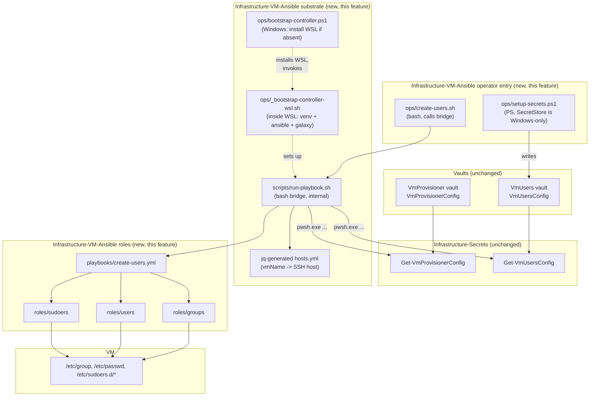
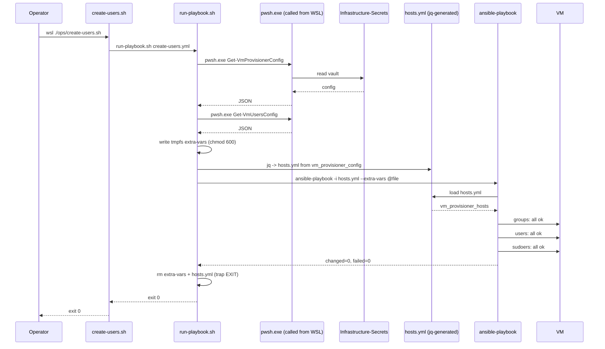

# Problem: Reconcile OS Groups, Users, and Sudoers via Ansible

## Index

- [Context](#context)
- [What Is Changing](#what-is-changing)
  - [Repo substrate (introduced by this feature)](#repo-substrate-introduced-by-this-feature)
    - [Controller bootstrap](#controller-bootstrap)
    - [Bash bridge: vault to extra-vars to ansible-playbook](#bash-bridge-vault-to-extra-vars-to-ansible-playbook)
    - [Inventory: YAML regenerated from vault JSON](#inventory-yaml-regenerated-from-vault-json)
    - [CI: YAML and Ansible lint gate](#ci-yaml-and-ansible-lint-gate)
  - [Role: groups](#role-groups)
  - [Role: users](#role-users)
  - [Role: sudoers](#role-sudoers)
  - [Entry point: create-users playbook](#entry-point-create-users-playbook)
  - [Operator entry point and vault setup in this repo](#operator-entry-point-and-vault-setup-in-this-repo)
- [Why Now](#why-now)
- [Affected Components](#affected-components)
- [Out of Scope](#out-of-scope)

---

## Context

Today `Infrastructure-Vm-Users/hyper-v/ubuntu/create-users.ps1` opens an SSH
session per VM and reconciles OS groups, users, and `/etc/sudoers.d/*` via
imperative PowerShell that wraps `groupadd` / `useradd` / `usermod` /
`visudo -c -f`. The logic is idempotent and well-tested but the
implementation duplicates patterns that Ansible's `ansible.builtin.group`,
`user`, and `copy` (with `validate:`) modules provide out of the box.

This is the first feature in `Infrastructure-VM-Ansible`. The repo will
eventually host roles for users, GitHub Actions runners, and toolchains
(JDK, .NET SDK, .NET global tools) — all of which target the same VMs and
read from the same vaults. This feature ships **both** the shared substrate
those future roles will consume (controller, vault-to-extra-vars bridge,
inventory generation) and the first concrete workload (users reconcile). The
substrate is not carved off into its own preceding feature because nothing
exists yet to validate it against — building the substrate and the first
real consumer together is the only way to know the substrate is correctly
shaped on day one.

The Vm-Users vault contract is unchanged: `VmUsersConfig` keeps its current
shape, and the `VmUsers` vault remains the canonical source for declared
users, groups, sudoers rules, and per-user passwords. Consumer repos
(`Infrastructure-GitHubRunners` today) continue to read deploy passwords
from the same vault.

---

## What Is Changing

### Repo substrate (introduced by this feature)

The substrate is single-purpose: turn an operator's
`wsl ./ops/create-users.sh` invocation into an `ansible-playbook`
invocation that runs against the right hosts with the right vars, on a
controller that has Ansible installed. Three pieces.

#### Controller bootstrap

A one-time setup pair provisions the Ansible controller on the operator's
Windows host. Two scripts because the work straddles the Windows/WSL
boundary:

| Script | Lang | Runs from | Purpose |
|--------|------|-----------|---------|
| `ops/bootstrap-controller.ps1` | PowerShell | Windows | Calls `Assert-Wsl2Ready` from `Common.PowerShell` to ensure WSL2 is installed and a distro is registered, then invokes the inside-WSL setup. WSL detection and install logic is **not** reimplemented here — `Assert-Wsl2Ready` already handles install-if-missing + reboot-required messaging + the `Wsl2NotReady:` catch contract used elsewhere in the org's repos. |
| `ops/_bootstrap-controller-wsl.sh` | bash | inside WSL | Creates the repo-local Python venv, installs Ansible, installs Galaxy collections. Operators can run this directly if WSL is already known to be present. |

| Decision | Value |
|----------|-------|
| WSL install policy | Install if not found, skip if found — delegated to [`Assert-Wsl2Ready`](https://github.com/Klark-Morrigan/Common-PowerShell/blob/master/Common.PowerShell/Public/Assert-Wsl2Ready.ps1) in `Common.PowerShell`. That function runs `wsl --install` unconditionally when WSL is not ready (idempotent on Windows 11) and throws a `Wsl2NotReady:` error the operator catches with a reboot prompt. `bootstrap-controller.ps1` uses the standard try/catch pattern documented in `Assert-Wsl2Ready`'s example. |
| Where Ansible runs | Inside WSL2 (Ubuntu). Windows is not an Ansible controller. |
| Python | A repo-local `.venv/` (gitignored) with pinned `ansible-core` and deps from `requirements.txt`. No system-wide Ansible install. |
| Galaxy collections | Installed from `requirements.yml` (`ansible.posix`, `community.general` as needed). Pinned by version. |
| Idempotence | Both scripts are re-run safe. `Assert-Wsl2Ready` short-circuits on already-ready WSL; the bash setup detects existing venv + collections and skips. |
| `pwsh.exe` as a prerequisite | PowerShell 7+ on the Windows host is a hard operator prerequisite, documented in the README alongside WSL2. The bootstrap does **not** detect or install it — `Import-Module Common.PowerShell` and `Infrastructure.Secrets` both require PS7, so any host that can launch `bootstrap-controller.ps1` already has it. The bash bridge's `pwsh.exe` invocation relies on the same prerequisite. |

#### Bash bridge: vault to extra-vars to ansible-playbook

A bash entry point (`scripts/run-playbook.sh`) that the operator-facing
per-playbook scripts (`create-users.sh`, etc.) call into. Generic over
which playbook is run; takes the playbook path and any tag/limit args.

| Decision | Value |
|----------|-------|
| Vault read | Invokes `pwsh.exe -NoProfile -NonInteractive -Command "Get-VmProvisionerConfig \| ConvertTo-Json -Depth 99"` and the matching call for `VmUsersConfig` (or any other vault the playbook needs, declared per-entry-point script). UTF-8 BOM stripping handled centrally. |
| Vault source of truth | `Infrastructure.Secrets` cmdlets. The bridge does not parse `SecretStore` directly. |
| Extra-vars file | Written to a tmpfs path (`$(mktemp -t ...)` under WSL), `chmod 600`, deleted via `trap EXIT` so cleanup runs on failure too. |
| Extra-vars shape | One top-level key per vault (`vm_provisioner_config`, `vm_users_config`), each holding the parsed JSON verbatim. Roles index by `inventory_hostname`. |
| Failure surface | Non-zero exit if the vault read fails, the playbook fails, or the extra-vars file cannot be written. Propagates the inner exit code. |

#### Inventory: YAML regenerated from vault JSON

The bridge writes a flat Ansible YAML inventory file to the same tmpfs
directory as the extra-vars file, derived from `vm_provisioner_config`
by a `jq` pipeline. `ansible-playbook` reads it via `-i`. Both files
are deleted together by the bridge's `trap EXIT`.

Generated shape:

```yaml
all:
  children:
    vm_provisioner_hosts:
      hosts:
        ubuntu-01-ci:
          ansible_host: 192.168.1.101
          ansible_user: u-admin
          ansible_become: true
          ansible_become_method: sudo
          ansible_become_pass: "..."
```

| Decision | Value |
|----------|-------|
| Source | The `vm_provisioner_config` array, transformed by `jq` in the bridge. No call back into PowerShell at inventory parse time — pwsh has already run and produced the JSON. |
| Host key | `vmName`. |
| Per-host vars | `ansible_host` (= `ipAddress`), `ansible_user` (= admin username), `ansible_become: yes`, `ansible_become_method: sudo`, `ansible_become_pass` (= admin password from the same vault). |
| Group | All VMs land in one group `vm_provisioner_hosts`. Per-VM groups can come later when a role needs them. |
| Unreachable hosts | Inventory does not pre-filter — Ansible's normal reachability handling skips offline hosts with a warning. |
| Why YAML over a custom Python plugin | The bridge runs every invocation anyway, so regenerating YAML is free, and the generated file is directly inspectable with `cat` while debugging. A custom plugin is the idiomatic Ansible answer but adds a third language (Python) to the repo for no v1 benefit. Migration is tracked in [05 - python inventory plugin](../05-python-inventory-plugin/notes.md). |

#### CI: YAML and Ansible lint gate

A single reusable-workflow caller (`.github/workflows/ci-yaml.yml`) wires
the repo into [Common-Automation's `ci-yaml.yml`](https://github.com/Klark-Morrigan/Common-Automation/blob/master/.github/workflows/ci-yaml.yml)
so every PR runs the four shared lint jobs: `actionlint`,
`action-validator`, `yamllint`, `ansible-lint`. The substrate this
feature ships (YAML inventory, requirements files, playbooks, roles)
is exactly the surface those linters cover; landing CI in the same
feature as the substrate keeps the bar synchronised from day one.

| Decision | Value |
|----------|-------|
| Where the linters live | Centralised in `Common-Automation`. This repo holds only the one-line caller, so version bumps and rule changes propagate org-wide via a single source. |
| Auto-skip semantics | `ansible-lint` skips with a `::notice::` when `ansible.cfg` / `playbooks/` / `roles/` are absent; the other three jobs lint their respective surfaces unconditionally. The first commit of step 1 ships `ansible.cfg`, so `ansible-lint` runs but has no playbooks to lint until step 5. |
| Repo-local lint config | None. The shared bar is the bar; per-repo `.yamllint` / `.ansible-lint` files only land if a real finding forces a documented relaxation. |
| Failure surface | A red CI run blocks merge. No bypass, no per-feature suppression. |

### Role: groups

Reconciles declared groups before any user is touched, so a user with a
declared primary group finds it ready.

| Decision | Value |
|----------|-------|
| Module | `ansible.builtin.group` |
| GID handling | When `gid` is declared, it is passed through and a mismatch fails the play (matches today's PowerShell behaviour — GIDs are never silently changed, so on-disk numeric ownership does not drift). |
| Missing optional `gid` | Group is created without a pinned GID; the kernel assigns one. |
| Loop input | `vm_users_config[inventory_hostname].groups \| default([])` |

### Role: users

Reconciles declared users after groups.

| Decision | Value |
|----------|-------|
| Module | `ansible.builtin.user` |
| Shell, home, supplementary groups | Set from config on create and update. |
| Home directory move | Disabled — `move_home: no`. Matches today's "homeDir is set only on creation, not relocated" guarantee, to avoid data loss. |
| Password | When `password` is set in config, hashed controller-side via `password_hash('sha512', salt=...)` and written with `update_password: always`. Plaintext is never written to the VM. The salt is **per-user-stable, derived from `username`** (e.g. `(username \| hash('md5'))[:16]`, satisfying SHA-512 crypt's 16-char limit and the `[A-Za-z0-9./]` salt charset). Why deterministic: salt is stored in plaintext in `/etc/shadow` anyway — its job is uniqueness across users (defeats rainbow tables), not unguessability. A random salt would re-hash the same plaintext to a different value every run, making Ansible report `changed: yes` on every reconcile run even when nothing actually changed. The deterministic per-user derivation gives true idempotence while keeping every user's salt unique. |
| Primary group | Defaults to the user's own name (Ansible default). If a primary group is declared in `groups`, it must exist (the groups role ran first). |

### Role: sudoers

Reconciles `/etc/sudoers.d/{username}` files after users.

| Decision | Value |
|----------|-------|
| Module | `ansible.builtin.copy` with `validate: 'visudo -cf %s'` |
| File mode | `0440`, `root:root` — the only mode `sudo` accepts. |
| Empty `sudoersRules` | The file is removed if present (matches today: "empty list = file absent"). |
| Validation failure | The play fails for that VM; the live file is untouched because `validate:` runs on the temp file before the swap. |

### Entry point: create-users playbook

`playbooks/create-users.yml` imports roles in order: `groups` -> `users` ->
`sudoers`. Tags allow targeting one slice (`--tags groups`).

The play targets the `vm_provisioner_hosts` group produced by the inventory
plugin. Hosts that are unreachable are skipped with a warning, not a
failure.

### Operator entry point and vault setup in this repo

The operator-facing surface for the new code path lives in
`Infrastructure-VM-Ansible/ops/`. `ops/` is reserved for hand-invoked
operator commands; bridge internals and dev/test runners stay under
`scripts/` (see plan.md's "Directory layout" preamble).

| New script | Lang | Purpose |
|------------|------|---------|
| `ops/create-users.sh` | bash | One-line wrapper that invokes `./scripts/run-playbook.sh playbooks/create-users.yml` with sensible defaults. Operators run it from inside WSL, or from Windows as `wsl ./ops/create-users.sh`. No PowerShell layer — the rest of this repo is bash + WSL + Ansible, and an outer PS wrapper would add a process boundary for no benefit. |
| `ops/setup-secrets.ps1` | PowerShell | Registers the `VmUsers` vault and stores `VmUsersConfig`. Must be PowerShell — `Microsoft.PowerShell.SecretStore` is a .NET module whose vault is encrypted under Windows DPAPI bound to the operator's Windows user account. Bash (even from WSL) cannot register or write to a SecretStore vault. Operators run it from Windows: `pwsh ops/setup-secrets.ps1`. |

`Infrastructure-Vm-Users` is **not touched** by this feature. Its scripts
keep working as before. Both code paths coexist during the lifetime of
feature 02 (and feature 03), which lets operators run the new playbook
against a VM and compare against the existing PowerShell behaviour if
they want to.

The `VmUsers` vault is the same vault either path consumes — same name,
same secret name, same JSON shape — so `Infrastructure-GitHubRunners` is
unaffected regardless of which entry point operators use.

The eventual archive of `Infrastructure-Vm-Users` happens at the **end of
feature 03**, when the removal path is also covered by this repo. There
is no "shim repo" stage and no piecemeal deletion of Vm-Users files in
between: Vm-Users is alive and untouched until feature 03's archive step
flips it off in one go.

---

## Why Now

- Migrating Vm-Users is the smallest of three planned migrations
  (users / runners / toolchains) and therefore the lowest-risk place to
  validate the entire `Infrastructure-VM-Ansible` substrate end-to-end.
  If the substrate's shape is wrong, this feature exposes it on the
  least-painful workload to redo.
- The reconcile logic in Vm-Users is the most direct fit for off-the-shelf
  Ansible modules — every concern (groups, users, sudoers with visudo
  validation) maps 1:1 to a built-in module. There is almost no custom
  Ansible to write; the value of the migration is the deletion of
  imperative PowerShell.
- Several upcoming features (GitHub runners, JDK reconciler) want to live
  in this repo. Building the substrate inside the first real consumer
  rather than as a speculative standalone feature avoids designing the
  substrate in the abstract and discovering at integration time that it
  is wrongly shaped.

---

## Affected Components



Sequence on a re-run against an already-reconciled VM (expected steady state):



---

## Out of Scope

- **User and group removal** — covered by feature 03
  ([03 - groups-users-sudoers-removal](../03-groups-users-sudoers-removal/)).
  Splitting create and remove keeps destructive semantics out of the
  feature that builds the substrate.
- **SSH key management** — Vm-Users today explicitly does not manage SSH
  keys; that boundary is preserved.
- **PAM configuration** — same as above.
- **Home directory migration** when `homeDir` changes — preserved as a
  manual step.
- **Archiving or modifying Infrastructure-Vm-Users.** Vm-Users is left
  alone during this feature; archive happens at the end of feature 03 in
  a single step.
- **Per-VM connection overrides** (custom SSH port, jump host). The
  jq-generated inventory produces flat direct-SSH connections; deviations
  are a later feature.
- **Bash versions of `Infrastructure-Secrets` cmdlets.** The bridge calls
  `pwsh.exe` directly. Promoting the bridge call into a reusable bash
  interface in `Infrastructure-Secrets` is deferred until a second Linux
  consumer materialises.
- **Typed sudoers rules (user/host/runas/commands fields).** `roles/sudoers`
  accepts the rules array verbatim — parity with today's Vm-Users contract
  where the operator owns the exact lines. A typed input shape would catch
  some typos earlier (before `visudo -cf` runs) but is a breaking change
  to the input schema, and `visudo -cf` is the authoritative check either
  way. Deferred to
  [04 - typed sudoers commands](../04-typed-sudoers-commands/notes.md).
- **Custom Python inventory plugin.** v1 uses YAML inventory regenerated
  from vault JSON by the bridge each run — fewer moving parts and the
  generated `hosts.yml` is directly inspectable for debugging. A custom
  plugin becomes worthwhile if per-host logic gets non-trivial or a
  second non-bridge consumer of the inventory appears. Deferred to
  [05 - python inventory plugin](../05-python-inventory-plugin/notes.md).

