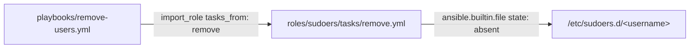
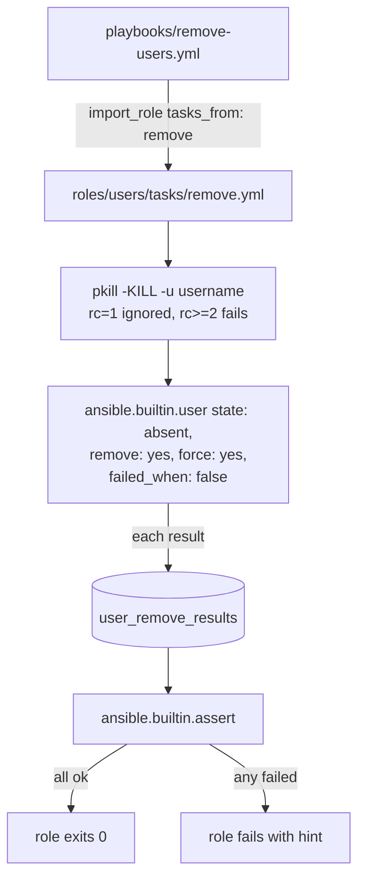
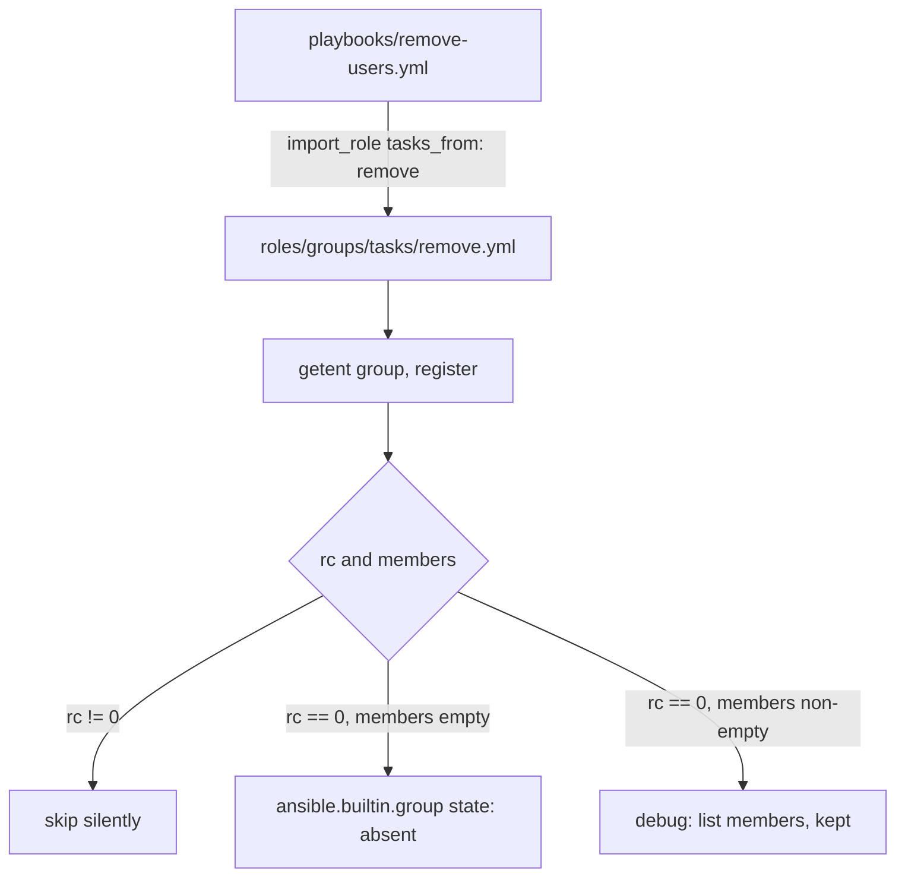
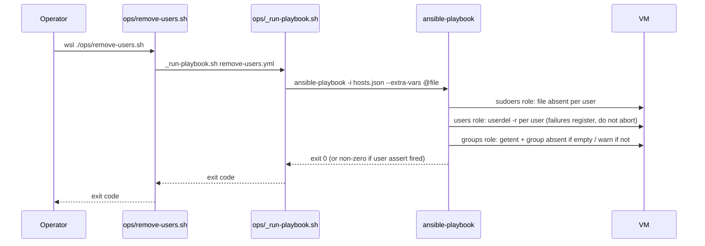
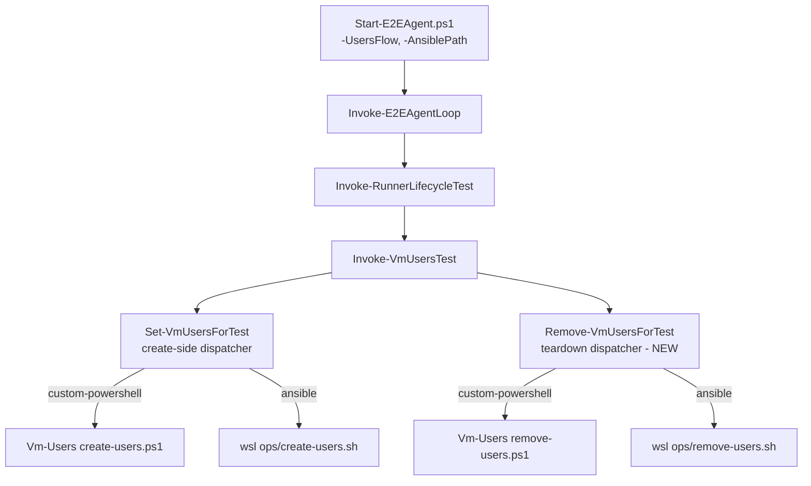
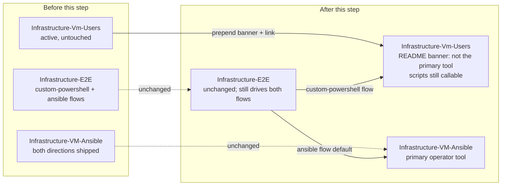

# Plan: Remove OS Groups, Users, and Sudoers via Ansible

See [problem.md](problem.md) for context, role contracts, and rationale.

## Shape

Feature 02 left three roles (`groups`, `users`, `sudoers`) with a
`tasks/main.yml` each that drives the create direction. Feature 03 adds
a sibling `tasks/remove.yml` per role. The new `remove-users.yml`
playbook imports each role with `tasks_from: remove` in the reverse
order (sudoers -> users -> groups). Two reasons for the per-role split
rather than a `state` parameter switch inside `tasks/main.yml`:

- Each direction has its own glue (e.g. the non-empty-group skip in the
  remove path) and its own test surface. Keeping them in separate files
  keeps each file small and grep-friendly.
- `import_role { name, tasks_from }` is a stock Ansible pattern; no
  custom dispatch needed.

Per-role README sections gain a "Remove direction" subsection so the
contract for both directions lives next to the role. Top-level README
gains an `ops/remove-users.sh` line in the operator surface table.

**Meta-dep posture.** Each role's `meta/main.yml` declares only the
direction-neutral `vm_users_entry` dep. No inter-role meta deps
(`sudoers` -> `users`, `users` -> `groups`): Ansible's meta
dependencies always run the dep's `tasks/main.yml` and ignore the
entry role's `tasks_from` selector, so
`import_role { name: sudoers, tasks_from: remove }` with a
`- role: users` meta dep would silently re-run `users/main.yml`
first, resurrecting the users this play is trying to delete. The
playbook is the single source of truth for role order:
`create-users.yml` lists groups -> users -> sudoers, and
`remove-users.yml` lists sudoers -> users -> groups. Trade-off:
standalone `ansible-playbook --tags sudoers` (or `--tags users`)
no longer auto-pulls create deps, but tag-scoped partial removal
is deferred (resolved open question #3 below) so the safety net
is not load-bearing. Role-level molecule scenarios that exercise
sudoers or users in isolation `include_role` their prerequisites
explicitly in their converge files.

Resolved open questions (problem.md / Open Questions):

1. **Non-empty-group skip logs member names**, not just the count.
   Higher diagnostic value, member list is bounded by the size of the
   group on the VM, low cost.
2. **User with running processes**: pre-kill via `pkill -KILL -u
   <username>` (ignoring rc=1 = no processes), then `userdel -f -r`
   via `force: yes`. Departure from the legacy PS behaviour that
   surfaced an error and moved on — operator-driven removal is a
   declared act and leaving processes alive is the surprising
   outcome. Per-iteration `failed_when: false` + `register` + final
   `assert` is kept as belt-and-braces for the rare case the
   pre-kill cannot free the account (D-state, kernel-thread parent).
3. **Tag-scoped partial removal** (`--tags sudoers` only, etc.) is
   **deferred**. The role tags exist (mirroring feature 02), but no
   special handling is planned. A future feature lifts them if the
   need materialises.

## Index

- [Step 1 - Role: sudoers (remove direction)](#step-1---role-sudoers-remove-direction)
- [Step 2 - Role: users (remove direction)](#step-2---role-users-remove-direction)
- [Step 3 - Role: groups (remove direction with non-empty skip)](#step-3---role-groups-remove-direction-with-non-empty-skip)
- [Step 4 - remove-users playbook and operator entry](#step-4---remove-users-playbook-and-operator-entry)
- [Step 5 - E2E remove-side fork](#step-5---e2e-remove-side-fork)
- [Step 6 - Mark Infrastructure-Vm-Users superseded](#step-6---mark-infrastructure-vm-users-superseded)

---

## Step 1 - Role: sudoers (remove direction)

**Reason:** Sudoers files reference users, so they are removed first.
This is the smallest of the three remove paths; landing it first
establishes the per-role `tasks/remove.yml` convention the next two
steps copy.

**Files**

- `roles/sudoers/tasks/remove.yml` (new) - single `ansible.builtin.file`
  task with `state: absent` looping over
  `vm_users_entry.users | default([])`, targeting
  `/etc/sudoers.d/{{ item.username }}`. Absence of the file is not an
  error (stock module behaviour). No template, no validate hook -
  removal does not invoke `visudo`.
- `roles/sudoers/README.md` (modified) - add a **Remove direction**
  subsection documenting the new `tasks_from: remove` entry point and
  its single-task shape.
- `Tests/molecule/sudoers/remove/` (new) - dedicated scenario covering
  the remove path in isolation. Lives outside `Tests/roles/` for the
  same reason as the existing create scenarios
  (ansible-lint's `var-naming[no-role-prefix]` would otherwise scan
  verify.yml as role content). The scenario's `prepare.yml` writes a
  couple of `/etc/sudoers.d/<username>` files to seed state; `converge`
  invokes the role with `tasks_from: remove`; `verify` asserts absence.

**Behaviour**

```yaml
- name: Remove sudoers drop-ins for declared users
  ansible.builtin.file:
    path: "/etc/sudoers.d/{{ item.username }}"
    state: absent
  loop: "{{ vm_users_entry.users | default([]) }}"
  loop_control:
    label: "{{ item.username }}"
```

**Tests (Molecule)**

- Seeded `/etc/sudoers.d/e2euser` present -> after converge, file is
  absent.
- Seeded files for a user **not** in `vm_users_config` -> still present
  after converge (this role removes only declared usernames; drift is
  out of scope per problem.md).
- Re-converge -> reports `changed: 0`.
- Empty `users` list -> no tasks executed, no errors.

**Diagram**



---

## Step 2 - Role: users (remove direction)

**Reason:** Users are removed after sudoers (drop-ins gone, no dangling
reference to a deleted account) and before groups (so `userdel` clears
implicit primary groups). The substantive piece of this step is the
pre-kill of running processes (problem.md / Role: users (remove)) so
operator-driven removal does not silently leave the user's processes
alive.

**Files**

- `roles/users/tasks/remove.yml` (new) - three tasks per the behaviour
  block below: a pre-kill `command`, the `ansible.builtin.user`
  removal, and a final `ansible.builtin.assert`. The user task uses
  `state: absent`, `remove: yes`, `force: yes`, loops over
  `vm_users_entry.users | default([])`, registers results with
  `failed_when: false` so the rare unkillable case does not abort the
  loop; the assert restores a non-zero exit code at the end.
- `roles/users/README.md` (modified) - add a **Remove direction**
  subsection covering: the pre-kill (`pkill -KILL -u`, ignoring rc=1),
  the `force: yes` flag (`userdel -f -r`) and why it differs from the
  legacy PS behaviour, the implicit-primary-group cleanup, and the
  final assert.
- `Tests/molecule/users/remove/` (new) - mirrors the step 1 scenario
  shape. `prepare` creates users via the create role; `converge`
  invokes `tasks_from: remove`; `verify` asserts absence with
  `getent passwd` and home directory removal with `stat`.

**Behaviour**

```yaml
- name: Kill any running processes owned by the user
  ansible.builtin.command: "pkill -KILL -u {{ item.username }}"
  loop: "{{ vm_users_entry.users | default([]) }}"
  loop_control:
    label: "{{ item.username }}"
  register: user_kill_results
  # pkill exits 1 when no matching process exists; that is the common
  # case (most accounts are not logged in) and is not an error here.
  # Any other non-zero (rc>=2: syntax error, permissions) is real and
  # we want to see it, so we surface rc>=2 as a failure.
  failed_when: user_kill_results.rc is defined and user_kill_results.rc >= 2
  changed_when: user_kill_results.rc == 0   # processes were actually killed

- name: Remove declared users
  ansible.builtin.user:
    name: "{{ item.username }}"
    state: absent
    remove: true   # userdel -r: deletes home directory
    force: true    # userdel -f: belt-and-braces against pre-kill miss
  loop: "{{ vm_users_entry.users | default([]) }}"
  loop_control:
    label: "{{ item.username }}"
  register: user_remove_results
  failed_when: false   # per-iteration failure does not abort the loop

- name: Assert no user removal errored
  ansible.builtin.assert:
    that:
      - user_remove_results.results
        | rejectattr('failed', 'equalto', false)
        | list | length == 0
    fail_msg: >-
      One or more user removals failed; see preceding task output.
      Likely cause: a process survived SIGKILL (D-state, kernel
      thread parent) and userdel -f could not free the account.
```

**Tests (Molecule)**

- Existing user with bash shell and password, not logged in -> absent
  after converge; `/home/<username>` absent. Pre-kill reports rc=1
  (no processes), removal task succeeds.
- Existing user not in config -> still present (no drift removal).
- User with no home directory (edge case from `useradd -M` history) ->
  removal still succeeds; assert passes.
- Re-converge against an already-removed user -> pre-kill reports
  rc=1, removal task reports `changed: 0`, assert passes.
- **User has a running process** (prepare.yml spawns `sleep infinity`
  as the user) -> pre-kill reports rc=0 with `changed: true`, removal
  task succeeds, account is gone, assert passes. This is the case the
  legacy PS flow would have left stuck.
- **Pre-kill syntax error simulated** (stub `pkill` exits 2) ->
  pre-kill task fails for that iteration; the loop continues to the
  next user but the iteration is captured; verify the final assert
  reports a useful error (covers the rc>=2 branch).

**Diagram**



---

## Step 3 - Role: groups (remove direction with non-empty skip)

**Reason:** Last of the three. The only piece in feature 03 that
requires glue beyond a stock module: the non-empty-group skip from
problem.md. Glue lives **here**, not in a separate role, so groups
logic stays in one place (decision locked in problem.md).

**Files**

- `roles/groups/tasks/remove.yml` (new) - per declared group:
  - `getent group <name>` via `ansible.builtin.command` with
    `register` and `failed_when: false` (absent group is not an error,
    matches the legacy "absent -> skip" contract).
  - Parse the members field (field 4 of the colon-separated record),
    set a per-iteration fact.
  - `ansible.builtin.group` with `state: absent` when the members
    field is empty.
  - `ansible.builtin.debug` warning that names the remaining members
    when non-empty (open question #1 resolved to log names).
- `roles/groups/README.md` (modified) - add a **Remove direction**
  subsection covering the non-empty-group contract (skip with warning,
  not force) and the absent-group contract (skip silently).
- `Tests/molecule/groups/remove/` (new) - prepare creates declared
  groups (and adds an out-of-config user as member in one scenario);
  converge runs `tasks_from: remove`; verify asserts removal vs.
  warned-and-skipped per case.

**Behaviour**

```yaml
- name: Check declared groups on the host
  ansible.builtin.command: "getent group {{ item.groupName }}"
  loop: "{{ vm_users_entry.groups | default([]) }}"
  loop_control:
    label: "{{ item.groupName }}"
  register: group_lookups
  failed_when: false        # absent group is not an error
  changed_when: false       # read-only probe

- name: Remove declared groups that are empty
  ansible.builtin.group:
    name: "{{ item.item.groupName }}"
    state: absent
  loop: "{{ group_lookups.results }}"
  loop_control:
    label: "{{ item.item.groupName }}"
  when:
    - item.rc == 0                                      # group exists
    - (item.stdout | default('') | split(':'))[3] == '' # no members

- name: Warn about non-empty declared groups (kept, not removed)
  ansible.builtin.debug:
    msg: >-
      Group '{{ item.item.groupName }}' kept: still has members
      ({{ (item.stdout | split(':'))[3] }}).
  loop: "{{ group_lookups.results }}"
  loop_control:
    label: "{{ item.item.groupName }}"
  when:
    - item.rc == 0
    - (item.stdout | default('') | split(':'))[3] != ''
```

**Tests (Molecule)**

- Declared group exists and is empty -> removed after converge.
- Declared group absent -> probe returns rc=2, no removal attempted,
  no error.
- Declared group has an out-of-config member -> not removed; warning
  message produced names the member.
- Declared group has the just-removed user as its only member (step 2
  cleared it) -> `getent` shows empty members at this stage (because
  step 2 of the play already ran), group is removed.
- Re-converge -> `changed: 0` for present-and-empty groups (now
  absent), and the warning task still emits for the still-non-empty
  case but `changed_when: false` keeps it idempotent.

**Diagram**



---

## Step 4 - remove-users playbook and operator entry

**Reason:** Wires the three new role entry points into one playbook
and gives operators a single command to invoke it. After this step the
remove flow is end-to-end runnable.

**Files**

- `playbooks/remove-users.yml` (new) - single play targeting
  `vm_provisioner_hosts`, importing roles in **sudoers -> users ->
  groups** order via `import_role { tasks_from: remove }`. Same
  `gather_facts: true`, `any_errors_fatal: false` posture as
  `create-users.yml` (one offline VM does not strand the rest).
- `ops/remove-users.sh` (new) - one-line operator wrapper invoking
  `./ops/_run-playbook.sh playbooks/remove-users.yml "$@"`. Mirrors
  `ops/create-users.sh`. Forwarded args let operators pass `--tags`,
  `--limit`, `--check`, etc.
- `ops/remove-users.bat` (new) - Explorer launcher; resolves Git Bash
  via `Common-Automation/scripts/_find-bash.bat`, then `exec`s
  `ops/remove-users.sh`. Mirrors `ops/create-users.bat`.
- `README.md` (modified) - add `ops/remove-users.sh` /
  `ops/remove-users.bat` to the operator surface table immediately
  below the create entries. No confirmation prompt; the destructive
  intent is in the script name and the operator's choice to invoke it
  (decision in problem.md).
- `roles/sudoers/meta/main.yml`, `roles/users/meta/main.yml`,
  `roles/groups/meta/main.yml` (modified) - each carries only the
  direction-neutral `vm_users_entry` meta dep. Comments in each
  file explain why inter-role create-direction deps are
  intentionally absent (would resurrect users mid-teardown — see
  **Meta-dep posture** in Shape).
- `playbooks/create-users.yml` (modified) - role-order comment
  states the playbook is the single source of truth for order,
  not the meta-dep graph.
- `Tests/molecule/sudoers/default/converge.yml`,
  `Tests/molecule/users/default/converge.yml` (modified) -
  prepend explicit `include_role` for the prerequisite role
  (users / groups respectively) so the role-level fixtures are
  self-seeding rather than relying on a meta-dep chain.

**Behaviour (playbook)**

```yaml
- name: Remove OS sudoers, users, and groups on provisioned VMs
  hosts: vm_provisioner_hosts
  gather_facts: true
  any_errors_fatal: false
  tasks:
    - ansible.builtin.import_role:
        name: sudoers
        tasks_from: remove
      tags: sudoers
    - ansible.builtin.import_role:
        name: users
        tasks_from: remove
      tags: users
    - ansible.builtin.import_role:
        name: groups
        tasks_from: remove
      tags: groups
```

**Tests**

Covered end-to-end by step 5 (E2E fork). The playbook itself has no
logic beyond role ordering, which step 5 exercises against a real VM.

**Diagram**



---

## Step 5 - E2E remove-side fork

**Reason:** Feature 02 introduced the create-side fork
(`Set-VmUsersForTest`) and explicitly deferred the teardown-side fork
to this feature (see feature 02's plan, step 13). The teardown of
both flows is currently stuck on `Infrastructure-Vm-Users`'s
`remove-users.ps1`; until this step lands, the Vm-Users repo cannot
be archived because the E2E layer still calls into it.

**Decisions locked**

- **Flow names match the create side.** `custom-powershell` and
  `ansible`. Same `[ValidateSet]` shape as `Set-VmUsersForTest`.
- **Default flow stays `ansible`** (same as create side after feature
  02). Calling pattern matches what operators already use.
- **`Infrastructure-Vm-Users` is not modified** until step 6.
  The `custom-powershell` teardown still invokes Vm-Users'
  `remove-users.ps1`; the `ansible` teardown invokes the new
  `ops/remove-users.sh` in this repo.
- **One layer, two flows** (same shape as the create fork): the
  remove-side dispatcher is `Remove-VmUsersForTest`; the existing
  teardown call in `Invoke-VmUsersTest` is extracted into it.
- **Parameter chain unchanged.** `Start-E2EAgent.ps1`'s existing
  `-UsersFlow`, `-AnsiblePath`, and `-WslDistro` parameters already
  propagate to `Invoke-VmUsersTest` via `$Config`; no new parameters
  needed - the teardown picks them up from the same chain.
- **Signature mirrors `Set-VmUsersForTest` exactly.** The remove
  dispatcher takes `-WslDistro` (not in the original sketch below)
  because the create-side dispatcher already needs it to avoid
  Docker Desktop's no-bash default-distro trap
  ([feedback_check_wsl_default_first](../../../../../.claude/projects/c--a-Code-Common-Automation/memory/feedback_check_wsl_default_first.md));
  the remove path runs the same bridge and would re-introduce the
  same bug without it. `-Entry` is also accepted for parity with the
  create-side dispatcher and any future per-host invocation logic
  (neither flow uses it today).

**Files (in Infrastructure-E2E)**

- `agent/e2e/vm-users/Remove-VmUsersForTest.ps1` (new) - the
  teardown dispatcher. Mirrors `Set-VmUsersForTest.ps1`'s shape and
  parameter list (`-UsersFlow`, `-UsersPath`, `-AnsiblePath`,
  `-WslDistro`, `-VmDef`, `-Entry`). Switches on `-UsersFlow`:
  - `custom-powershell` -> invokes
    `& "$UsersPath\hyper-v\ubuntu\remove-users.ps1" -SecretSuffix
    $script:E2ETestSecretSuffix` (same arg shape as the create-side
    PS call so both directions read the same E2E-scoped vault entry).
  - `ansible` -> `Push-Location $AnsiblePath` then
    `& wsl -d $WslDistro -- ./ops/remove-users.sh 2>&1 | Out-Host`
    (anchored cwd over `wsl --cd`'s sparse-PATH interop, native-stdout
    Out-Host so subexpression callers do not swallow the bridge
    output - same gotchas as the create-side dispatcher), propagates
    `$LASTEXITCODE`.
  - Any other value is rejected by `ValidateSet` at parameter binding
    time.
- `agent/e2e/vm-users/Invoke-VmUsersTest.ps1` (modified) - dot-source
  the new dispatcher next to `Set-VmUsersForTest`, then replace the
  inline `& "$($Config.UsersPath)\hyper-v\ubuntu\remove-users.ps1"`
  call inside `Invoke-VmUsersTeardown` with
  `Remove-VmUsersForTest -UsersFlow $Config.UsersFlow ...`. No new
  parameters on `Invoke-VmUsersTeardown`; both production callers
  (`Invoke-VmUsersTest` and `Invoke-RunnerLifecycleTest`) already
  pass a `$Config` that carries `UsersFlow`/`AnsiblePath`/`WslDistro`
  unconditionally, so strict-mode property access is safe.
- `Tests/Remove-VmUsersForTest.Tests.ps1` (new, Pester) - unit tests
  for the teardown dispatcher. Lives at the flat `Tests/` root next
  to `Set-VmUsersForTest.Tests.ps1`, matching the repo's existing
  convention (no nested `Tests/agent/e2e/vm-users/` tree).
- No edit to `Invoke-VmUsersTest.Tests.ps1` - that file does not exist
  in the repo today. The dispatcher boundaries are covered by the new
  unit tests; integration of the full create+remove chain is covered
  by the real-VM acceptance runs below.

**Behaviour (Remove-VmUsersForTest)**

```powershell
function Remove-VmUsersForTest {
    [CmdletBinding()]
    param(
        [Parameter(Mandatory)] [ValidateSet('custom-powershell','ansible')] [string] $UsersFlow,
        [Parameter(Mandatory)] [string]          $UsersPath,
        [string]                                 $AnsiblePath,
        [string]                                 $WslDistro,
        [Parameter(Mandatory)] [PSCustomObject]  $VmDef,
        [Parameter(Mandatory)] [object]          $Entry
    )

    switch ($UsersFlow) {
        'custom-powershell' {
            & "$UsersPath\hyper-v\ubuntu\remove-users.ps1" -SecretSuffix $script:E2ETestSecretSuffix
            if ($LASTEXITCODE -ne 0) {
                throw "custom-powershell remove-users.ps1 exited $LASTEXITCODE"
            }
        }
        'ansible' {
            if (-not $AnsiblePath) { throw 'UsersFlow=ansible requires -AnsiblePath' }
            if (-not $WslDistro)   { throw 'UsersFlow=ansible requires -WslDistro' }
            Push-Location $AnsiblePath
            try {
                & wsl -d $WslDistro -- ./ops/remove-users.sh 2>&1 | Out-Host
            }
            finally { Pop-Location }
            if ($LASTEXITCODE -ne 0) {
                throw "Ansible remove-users.sh exited $LASTEXITCODE"
            }
        }
    }
}
```

**Tests (Pester, mocked)**

- `UsersFlow=custom-powershell` -> invokes the PS script; `wsl` is
  never called; non-zero exit -> throws with exit code.
- `UsersFlow=ansible` with `AnsiblePath` + `WslDistro` set -> invokes
  `wsl -d <distro> -- ./ops/remove-users.sh` from the AnsiblePath
  cwd; the PS script is never called; non-zero exit -> throws with
  exit code.
- `UsersFlow=ansible` without `AnsiblePath` -> throws
  `*requires -AnsiblePath*`.
- `UsersFlow=ansible` without `WslDistro` -> throws
  `*requires -WslDistro*`.
- Unknown `UsersFlow` value -> rejected by `ValidateSet` at parameter
  binding time.

**Infrastructure-E2E README update**

- Document `Remove-VmUsersForTest` in the same section that already
  covers `Set-VmUsersForTest` (added in feature 02). Both flows are
  permanent first-class implementations; teardown is no longer
  flow-agnostic.
- Note the cross-compat: an `ansible` create can be paired with a
  `custom-powershell` remove and vice versa, because both directions
  reconcile by username against the same on-VM contract.

**Diagram**



---

## Step 6 - Mark Infrastructure-Vm-Users superseded

**Reason:** Final step of feature 03. Up to this point the migration
honours the
[don't-mutate-repos-being-archived](../../../../../.claude/projects/c--a-Code-Common-Automation/memory/feedback_dont_mutate_repos_being_archived.md)
rule — Vm-Users has been completely untouched while both create and
remove paths exist in parallel. With step 5 validated, the legacy
repo just needs a visible breadcrumb at the top of its README pointing
operators at the new home. The GitHub-side archive flag and the
description are updated by the operator out of band, not by this
feature.

Vm-Users is **not** retired. Step 5's `custom-powershell` flow
permanently wires `create-users.ps1` and `remove-users.ps1` into the
E2E layer as a first-class non-primary implementation; the banner
this step adds calls out that Vm-Users is no longer the operator
default, not that it is dead code.

**Decisions locked**

- **Light-touch README edit.** A short banner and a link to
  `Infrastructure-VM-Ansible` are prepended; the rest of the README
  is untouched. Preserving the existing content keeps the repo
  legible for the `custom-powershell` E2E flow that still calls into
  it.
- **PowerShell scripts stay in place and stay callable.** Not
  deleted. The E2E `custom-powershell` flow keeps invoking them, so
  any change of contract here would break that flow's parity check
  against the Ansible path.
- **GitHub archive flag and description are manual.** Out of scope
  for this feature; the operator flips them via repo settings after
  the README commit lands.
- **Trigger condition.** This step runs only after step 5's three
  recorded acceptance runs pass and the operator confirms the
  Ansible flow has been the default for at least one real
  reconcile cycle on the production VMs (not just E2E).

**Files (in Infrastructure-Vm-Users)**

- `README.md` (modified, prepend only) - new banner at the very top:
  - One line stating the repo is no longer the operator default;
    `Infrastructure-VM-Ansible` is.
  - One line noting the scripts here are kept callable for the E2E
    `custom-powershell` flow.
  - One link to `Infrastructure-VM-Ansible` with a one-sentence
    pointer to its `docs/dev/implementation/02-...` and `03-...`
    folders as the canonical home of the migrated logic.

  Everything below the banner stays as-is. No section reshuffles.

**Files (in Infrastructure-VM-Ansible)**

None. The "Vm-Users coexists" wording added in features 02 / 03 stays
accurate while validation is ongoing; if any of it needs trimming
once the archive flag flips, that is a follow-up README pass, not
part of this feature.

**Behaviour**

1. Prepend the warning banner + link to Vm-Users' `README.md` and
   commit on its `master` branch.
2. (Operator, out of band) Update the GitHub description and flip
   the archive switch via repo settings.

**Tests**

None. This step is a one-time operational action; the validation
already happened in step 5. No CI surface in either repo changes.

**Diagram**


