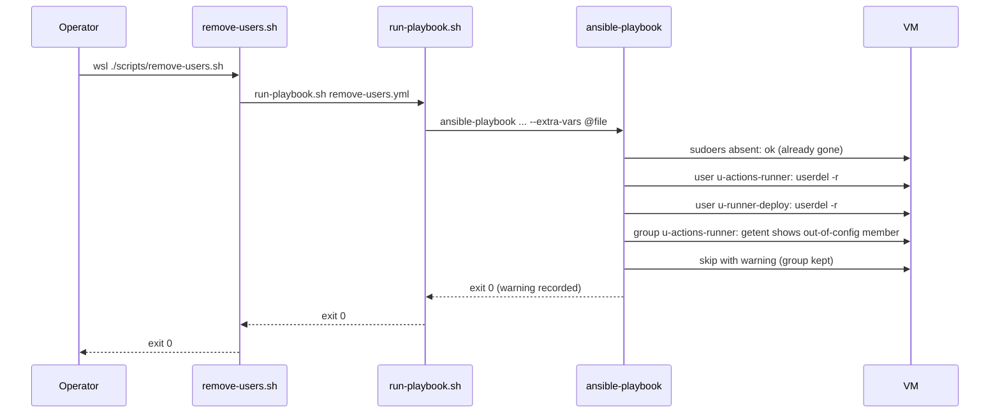

# Problem: Remove OS Groups, Users, and Sudoers via Ansible

## Index

- [Context](#context)
- [What Is Changing](#what-is-changing)
  - [Inputs (consumed, not redefined)](#inputs-consumed-not-redefined)
  - [Role: sudoers (remove)](#role-sudoers-remove)
  - [Role: users (remove)](#role-users-remove)
  - [Role: groups (remove)](#role-groups-remove)
  - [Entry point: remove-users playbook](#entry-point-remove-users-playbook)
  - [Operator entry point in this repo](#operator-entry-point-in-this-repo)
  - [Mark Infrastructure-Vm-Users superseded](#mark-infrastructure-vm-users-superseded)
- [Why Now](#why-now)
- [Affected Components](#affected-components)
- [Out of Scope](#out-of-scope)

---

## Context

`Infrastructure-Vm-Users/hyper-v/ubuntu/remove-users.ps1` deletes every
declared user and group from each reachable VM. Removal is a deliberate
operator action — Vm-Users does not auto-remove on config drop, because
silently deleting a user when a config entry vanishes is too easy to do
by accident.

Feature 02 of this repo migrated the create/update path to Ansible. This
feature migrates the symmetric removal path. The two are split into
separate features for one reason only: removal is the destructive path,
and bundling it with create would have meant designing destructive
semantics on top of an unproven controller pattern. With feature 02 shipped
and the controller validated, removal can be designed on its own merits.

The vault contract is unchanged. `VmUsersConfig` is still the declared
desired state; running this playbook reinterprets that same config as
"remove the entries listed here," which matches today's
`remove-users.ps1` semantics exactly.

---

## What Is Changing

### Inputs (consumed, not redefined)

Same inputs as feature 02 — inventory derived from `VmProvisionerConfig`,
admin password from the same vault, `VmUsersConfig` parsed into extra-vars.
No new vault entries and no new schema fields.

### Role: sudoers (remove)

Runs **first**, before user removal, so that an interrupted run never
leaves a sudoers file pointing at a user that has been deleted (which is
harmless but confusing).

| Decision | Value |
|----------|-------|
| Module | `ansible.builtin.file` with `state: absent` |
| Target | `/etc/sudoers.d/{username}` for every declared user |
| Absence | Not an error (matches today). |

### Role: users (remove)

Runs second.

| Decision | Value |
|----------|-------|
| Module | `ansible.builtin.user` with `state: absent`, `remove: yes`, `force: yes` |
| Effect | Equivalent to `userdel -f -r` — deletes the account and its home directory; `-f` lets `userdel` proceed when the user is logged in or owns files. |
| Running processes | Killed proactively **before** `userdel` runs: a pre-task issues `pkill -KILL -u <username>` per declared user, ignoring rc=1 (no processes). Departure from the legacy PS behaviour, which surfaced a failure for the user-with-processes case and moved on. Operator-driven removal is a deliberate, declared act; leaving processes alive after the operator asks the account gone is the surprising outcome, not killing them. The pre-kill is best-effort, not authoritative: a process that survives SIGKILL (uninterruptible D-state, kernel thread parent) will leave `userdel -f -r` to deal with it. |
| Implicit primary group | Removed automatically by `userdel` when the group has the same name as the user and no remaining members. |
| Absence | Not an error. |
| Per-iteration failure | Captured (`failed_when: false` + `register`) so a stuck removal does not abort the play; a final `assert` fails the play at the end if any iteration errored, preserving a non-zero exit code. Belt-and-braces against the rare case the pre-kill could not free the account. |

### Role: groups (remove)

Runs **last**, after all declared users for the VM are gone.

| Decision | Value |
|----------|-------|
| Module | `ansible.builtin.group` with `state: absent` |
| Non-empty group | When a group still has members (e.g. a user not in this config joined it), the group is **skipped with a warning that names the remaining members**, not forcibly removed. Matches today's "warned and skipped rather than forcing deletion" guarantee — protects against deleting a group an operator added by hand. Member names (not just count) because the diagnostic value of "which account is still holding this group open" is what the operator needs to decide the next step. |
| Absence | Not an error. |

The non-empty-group skip is the only piece in this feature that requires
glue beyond a stock module call: a small pre-check task (`getent group X`,
then conditional skip) wraps the `group: state=absent` invocation. The
glue lives in `roles/groups` (extending the role from feature 02) rather
than in a separate role, so groups logic stays in one place.

### Entry point: remove-users playbook

`playbooks/remove-users.yml` imports the roles in order:
`sudoers (remove)` -> `users (remove)` -> `groups (remove)`.

The reversal vs. feature 02's create order (groups, users, sudoers) is
deliberate: dependency direction is opposite for teardown — sudoers files
reference users, users reference groups, so each layer is removed only
after its dependents are gone.

Hosts that are unreachable are skipped with a warning, not a failure —
same posture as feature 02.

### Operator entry point in this repo

Same pattern as feature 02 — bash entry point, no PowerShell wrapper:

| New script | Lang | Purpose |
|------------|------|---------|
| `scripts/remove-users.sh` | bash | One-line wrapper invoking `./scripts/run-playbook.sh playbooks/remove-users.yml`. Operators run it from inside WSL, or from Windows as `wsl ./scripts/remove-users.sh`. |

`Infrastructure-Vm-Users` is **not modified** while this feature is in
development — its `remove-users.ps1` keeps working in parallel, available
as a fallback during validation.

A confirmation prompt is **not** added. Today's `remove-users.ps1` does
not prompt either, and the destructive intent is already in the script
name and the operator's choice to invoke it.

### Mark Infrastructure-Vm-Users superseded

This is the final step of feature 03 and happens **after** the new
removal path is validated. Up to this point Vm-Users has been completely
untouched by the migration; both create and remove paths exist twice (in
Vm-Users and in this repo) and operators can validate the new ones
against the old ones.

Vm-Users is **not** retired by this step. The Infrastructure-E2E
`custom-powershell` flow (locked in feature 02 / step 13 and extended
to the remove side in feature 03 / step 5) keeps invoking Vm-Users'
`create-users.ps1` and `remove-users.ps1` as a permanent first-class
non-primary implementation. The banner this step adds calls out that
Vm-Users is no longer the operator default, not that it is dead code.

1. A short banner and a link to `Infrastructure-VM-Ansible` are
   prepended to the top of `Infrastructure-Vm-Users/README.md`,
   noting that the repo is no longer the operator default and that
   its scripts remain callable via the E2E `custom-powershell`
   flow. Nothing else in the file is rewritten; the PowerShell
   scripts are left in place and stay runtime-live for E2E.

After this, the operator's primary entry points are in
`Infrastructure-VM-Ansible` (new home). `Infrastructure-Vm-Provisioner`
is unchanged so far; `Infrastructure-GitHubRunners` is a later migration
target. Vm-Users itself is now operator-secondary but still runtime-live
through the E2E `custom-powershell` flow.

---

## Why Now

- Feature 02 validated the controller pattern against the create path;
  removal can now be built on a proven foundation rather than co-designed
  with it.
- The PowerShell removal script duplicates roughly the same surface as the
  create script (one path per resource), so the deletion of imperative
  PowerShell yields a comparable simplification.
- Symmetric coverage matters before Infrastructure-Vm-Users can be
  archived. Leaving removal in PowerShell while create is in Ansible would
  mean Vm-Users has to live forever; archiving requires both paths covered
  by the new repo.

---

## Affected Components

Sequence with one group still in use by an out-of-config user:

---

## Out of Scope

- **Removing users that are no longer in `VmUsersConfig` but still exist
  on the VM.** That is "drift removal" and is a different posture from
  "remove what is declared here." Vm-Users has deliberately never done
  this, and the rationale survives the migration — silently deleting a
  user just because its config entry was edited out is too dangerous.
  Operators who want a user gone declare it in config and run
  `remove-users.yml`.
- **Home-directory backup before deletion.** `userdel -r` deletes the
  home dir. Operators who want a backup do it before invoking removal.
- **Force-removing a non-empty group.** The skip-with-warning behaviour
  is the contract. A future `--force` flag would be additive and is not
  needed for this feature.
- **A confirmation prompt in the entry point.** Out of scope by design —
  see the entry point section above.
- **Migrating Infrastructure-GitHubRunners.** That repo continues to read
  `VmUsersConfig` from the `VmUsers` vault as before; this feature does
  not change the vault or the consumer. The runners migration is its own
  later feature.
- **Partial-removal scoping in `remove-users.yml`** (e.g. a flag that
  removes only sudoers while leaving the user, or only the user while
  leaving sudoers). Useful for partial rollback during a failed deploy,
  but speculative — the create/remove feature split already covers the
  common cases. The per-role tags (`sudoers`, `users`, `groups`) exist
  on the play so `--tags` can scope a run if a future need surfaces,
  but no special handling beyond what tags give for free is planned
  here. A future feature lifts this when a real use case materialises.
